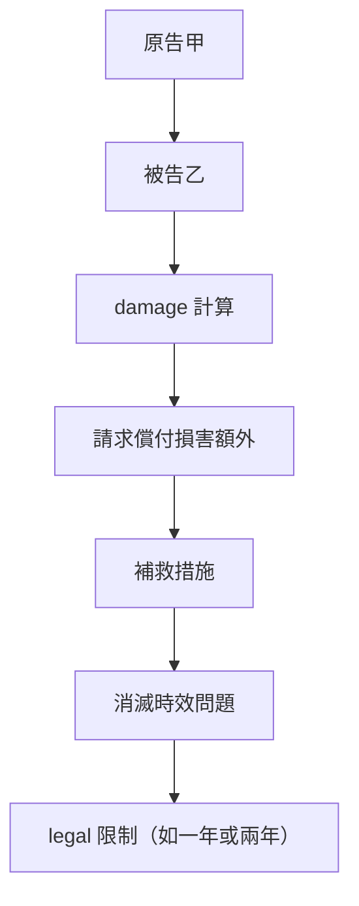

# 🎥 影音教材板書校對筆記
- **來源影片**: [預約 21 2024-12-10 18-14-33-501](file:///E:/法律/民法B/ch21/預約 21 2024-12-10 18-14-33-501.mp4)
- **課程分類**: `預設課程`
- **課堂章節**: `ch21`
- **影片時間戳記**: `00:07:15` (435 秒)
- **板書類型**: `關係圖/邏輯圖板書`
- **偵測時間**: 2026-07-13 20:34:58

## 🔍 擷取黑板板書對照圖

## 🧠 AI 智慧理解與知識庫演化註記
### 

根據辨識出的板書內容，結合臺灣現行法律條文（如民法第184條、侵權行為、消滅時效等），進行語意整理並與法律條文進行比對。以下是具體分析：

#### 1. 權力 board之內容分析：
- **民法第184條**：涉及侵權行為的責任承继和 damage 計算。
- **消滅時效問題**：可能涉及時間限制（如一年或兩年）內需採取適當措施以消除損傷。

#### 2. 法律條文比對與理解演化註記：
- **民法第184條**：规定因侵權行為造成損害，受害人得向施加侵權者請求償付損害額外。该條文并未直接涉及消滅時效的問題。
- **消滅時效**：在某些情况下（如 damage 可以通过补救措施消除），可能需要结合民法第184條的責任承继進行分析。

###

## 📊 可編輯之 Mermaid 關係流程圖

## ✍️ 操作者手動校對修改區
<!-- 您可以直接修改上方的文字或調整 Mermaid 區塊中的節點，Obsidian 會即時重新渲染 -->
- [ ] 欄位結構與法律邏輯已校對無誤。
- **校對筆記**: 
