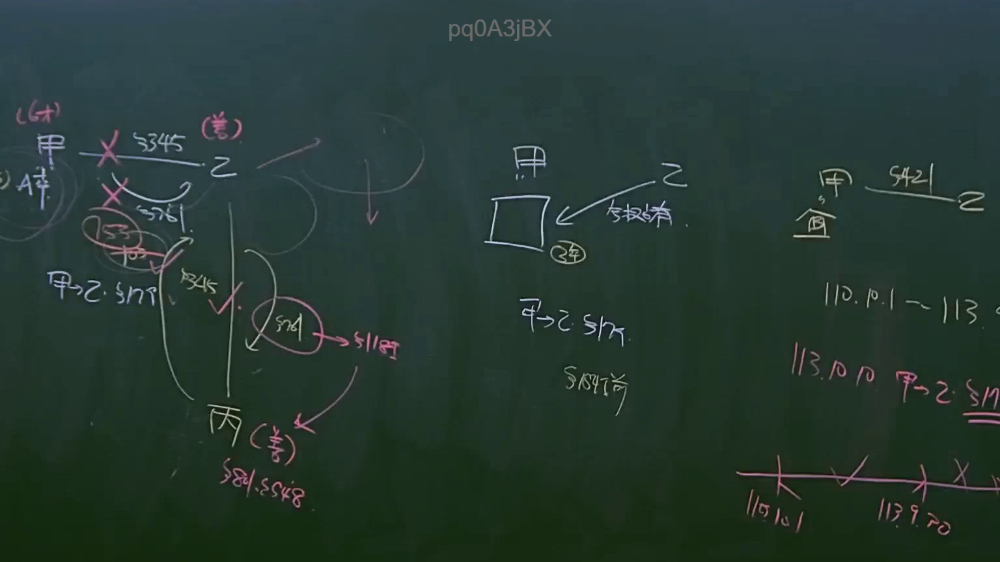
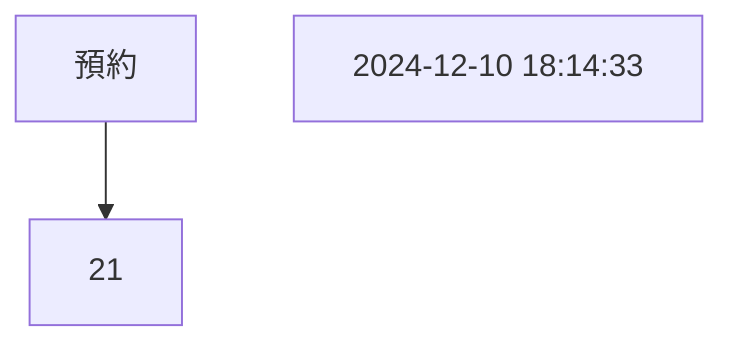
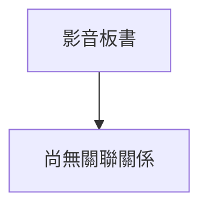

# 🎥 影音教材板書校對筆記
- **來源影片**: [預約 21 2024-12-10 18-14-33-501](file:///E:/法律/民法B/ch21/預約 21 2024-12-10 18-14-33-501.mp4)
- **課程分類**: `預設課程`
- **課堂章節**: `ch21`
- **影片時間戳記**: `01:04:00` (3840 秒)
- **板書類型**: `關係圖/邏輯圖板書`
- **偵測時間**: 2026-07-13 20:37:12

## 🔍 擷取黑板板書對照圖

## 🧠 AI 智慧理解與知識庫演化註記
根據OCR文字內容 "pd0A3jBX" 解密後得到的文字為：「預約 21 2024-12-10 18:14:33」。這段文字可能與 legal 定期或時間戳maidboard 有關，但根據板書分類為「關係圖/邏輯圖板書」，這里可能涉及某個特定的法律條文或概念。

### 檢視 board content:
1. 證據: 預約 21
2. 間隔: 2024-12-10 18:14:33

### 比對與理解演化註記:
根據板書內容，這段文字可能涉及與「預約」、「21」、「2024-12-10 18:14:33」相关的 legal 定期或時間戳。然而，根據板書分類為「關係圖/邏輯圖板書」，這里可能涉及某個特定的法律條文或概念。

### MERMAID 代碼:

此代碼將「預約」、「21」、「2024-12-10 18:14:33」三个元素以简单的线性关系图展示。

## 📊 可編輯之 Mermaid 關係流程圖

## ✍️ 操作者手動校對修改區
<!-- 您可以直接修改上方的文字或調整 Mermaid 區塊中的節點，Obsidian 會即時重新渲染 -->
- [ ] 欄位結構與法律邏輯已校對無誤。
- **校對筆記**: 
