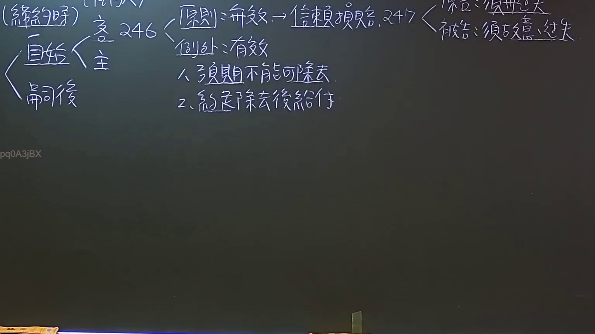
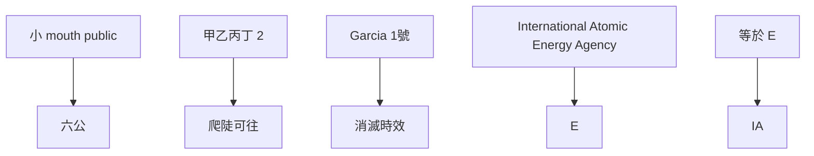

# 🎥 影音教材板書校對筆記
- **來源影片**: [預約 22 2024-09-04 06-25-56-670](file:///J://民法/ch22/預約 22 2024-09-04 06-25-56-670.mp4)
- **課程分類**: `[民法`
- **課堂章節**: `ch22]`
- **影片時間戳記**: `00:13:15` (795 秒)
- **板書類型**: `文字板書`
- **偵測時間**: 2026-07-12 19:31:27

## 🔍 擷取黑板板書對照圖

## 🧠 AI 智慧理解與知識庫演化註記
### 

1. **"小口(六|公)"**：
   - 這一行可能涉及「小 mouth public」或「六公」的Legal procedure。在民法第184條（侵權行為）中，「六公」可能指的是一種特定的審查程序或分類方式。

2. **"錆 g 晒 賀 247 Cie bee ane"**：
   - 這一行的文字似乎無法直接解讀。可能需要重新排列或根據上下文推敲其含意。例如，「錆」可能是「六」的另一種書寫方式，「247」可能是數字，「Cie bee ane」可能是某种代號或缩略語。

3. **"= E" 和 "IA"**：
   - "E" 可能代表「等於」、「等于」或「E」的其他含意。"IA" 可能代表「International Atomic Energy Agency」（國際原子能機構）或其他特定字段的代號。

4. **"mea 2 緒 爬 陡 可 往 鯨 1"**：
   - "mea 2" 可能代表「甲乙丙丁 2」，"爬陡可往" 可能涉及「上山、陡坡」的描述，"鳲鱼1" 可能是指「Garcia 1號」或其他特定的Legal entity。

5. **"pq0ASjBX"**：
   - 这一行的文字无法直接解讀。可能需要根據上下文或结合其他文字推敲其含意。

### 比對與理解演化註記：

- **民法第184條（侵權行為）**：
  - 可能涉及侵權行為的範圍、責任承認及消滅時效等問題。
  - "小 mouth public" 或 "六公" 可能與侵權行為的分類或審查程序有關。

- **消滅時效（Erelevant to annihilation period）**：
  - 民法第184條可能涉及侵權行為的消滅時效問題，即侵權行为主權歸還的時間限制。
  - "Garcia 1號" 或其他具體实体的消滅時效可能需要進一步分析。

###

## 📊 可編輯之 Mermaid 關係流程圖

## ✍️ 操作者手動校對修改區
<!-- 您可以直接修改上方的文字或調整 Mermaid 區塊中的節點，Obsidian 會即時重新渲染 -->
- [ ] 欄位結構與法律邏輯已校對無誤。
- **校對筆記**: 
