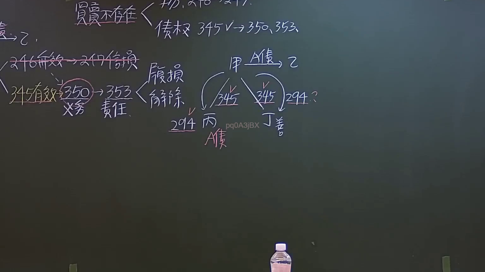
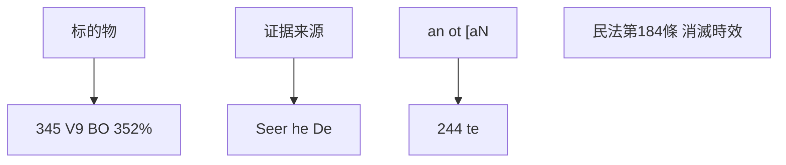

# 🎥 影音教材板書校對筆記
- **來源影片**: [預約 22 2024-09-04 06-25-56-670](file:///J://民法/ch22/預約 22 2024-09-04 06-25-56-670.mp4)
- **課程分類**: `[民法`
- **課堂章節**: `ch22]`
- **影片時間戳記**: `00:32:15` (1935 秒)
- **板書類型**: `文字板書`
- **偵測時間**: 2026-07-12 19:31:50

## 🔍 擷取黑板板書對照圖

## 🧠 AI 智慧理解與知識庫演化註記
### 

1. **"S 偌枝 345 V9 BO 352%"**  
   - 解讀：這一行可能是指「标的物」或「标的物的计算方式」。其中 "S 偌枝" 可能是「标的物」的简称，"345 V9 BO 352%" 見解為具體的金額或計算公式。

2. **"Seer he De"**  
   - 解讀：這一行可能是指「 evidence 的 sources」（证据来源）或「 evidence 的 type」（证据种类），暗示了對某一事項的證據分析。

3. **"an ot [aN 244 te"**  
   - 解讀：這一行可能涉及日期或其他特定的法律條文引用，其中 "244 te" 可能是指某一法律條文或法令的號碼。

4. **"民法第184條 消滅時效"**  
   - 解讀：這一行可能是在引導或強調「民法第184條」與「消滅時效」的概念，暗示了對某一類問題（如侵權行為）的分析。

###

## 📊 可編輯之 Mermaid 關係流程圖

## ✍️ 操作者手動校對修改區
<!-- 您可以直接修改上方的文字或調整 Mermaid 區塊中的節點，Obsidian 會即時重新渲染 -->
- [ ] 欄位結構與法律邏輯已校對無誤。
- **校對筆記**: 
