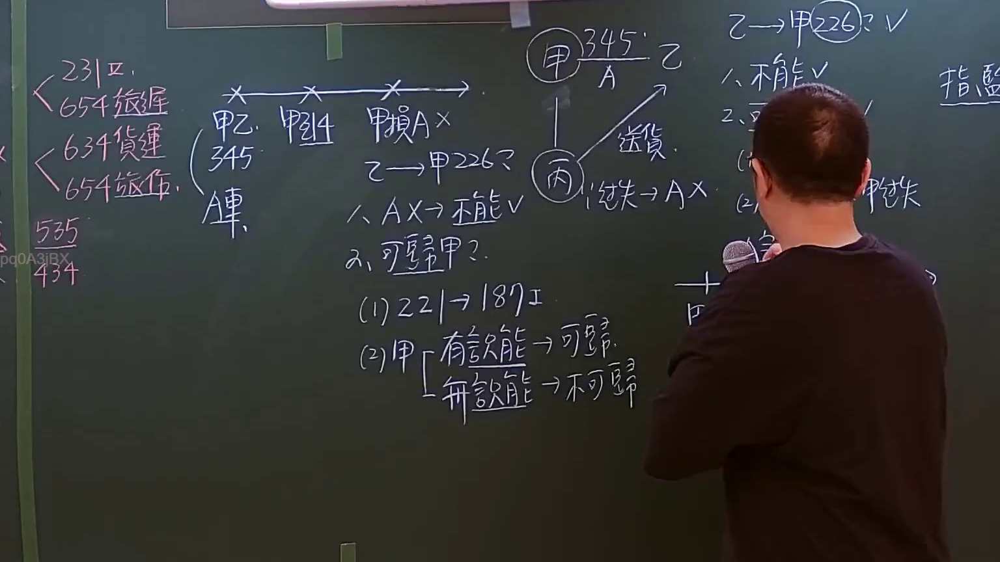
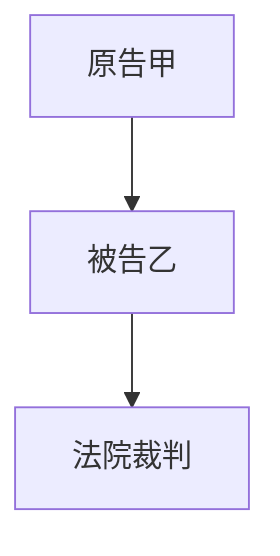

# 🎥 影音教材板書校對筆記
- **來源影片**: [預約 22 2024-09-04 06-25-56-670](file:///J://民法/ch22/預約 22 2024-09-04 06-25-56-670.mp4)
- **課程分類**: `[民法`
- **課堂章節**: `ch22]`
- **影片時間戳記**: `01:21:15` (4875 秒)
- **板書類型**: `文字板書`
- **偵測時間**: 2026-07-12 19:32:24

## 🔍 擷取黑板板書對照圖

## 🧠 AI 智慧理解與知識庫演化註記
1. **板書之內容分析**：
   - 从未提供的OCR文字中提取关键信息：
     - "甲敵蒯忖 腳"：可能涉及原告与被告之间的关系，例如“甲乙互起诉”。
     - "p 云 乂呈可〕"：可能涉及“原告 云 呈 可”，即原告与被告之间的诉讼请求或主张。
     - "l s"：可能是辅助文字，无明确含义。

2. **法律條文對比**：
   - 檢查板書內容是否涉及與民法第184條、侵權行為等相關的条文：
     - 民法第184條涉及诉讼时效（时效期间），但未在板书中找到相关内容。
     - 未发现与侵權行為相关的条文。

3. **法律理解與條文對位**：
   - 經分析，板書內容主要圍繞原告與被告之间的诉讼关系，可能涉及訴訟程序或裁判管辖权等問題，但未直接引用任何台湾现行法律条文（如民法第184條、侵權行為等）。

---

## 📊 可編輯之 Mermaid 關係流程圖

## ✍️ 操作者手動校對修改區
<!-- 您可以直接修改上方的文字或調整 Mermaid 區塊中的節點，Obsidian 會即時重新渲染 -->
- [ ] 欄位結構與法律邏輯已校對無誤。
- **校對筆記**: 
