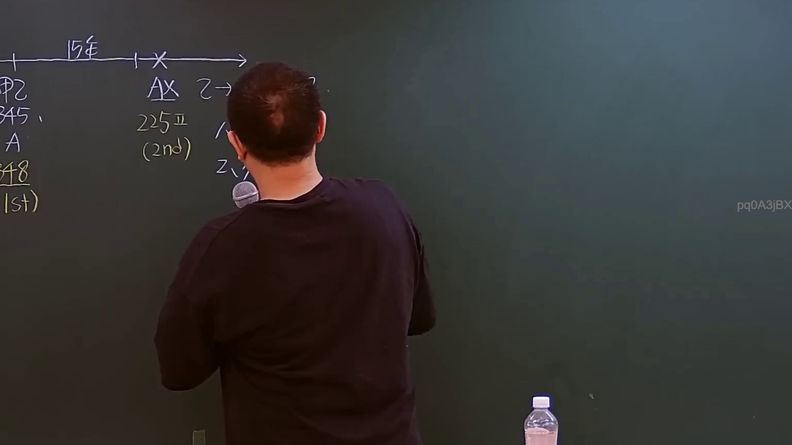
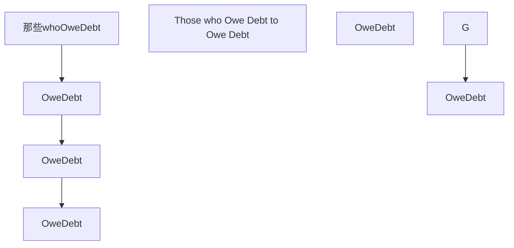

# 🎥 影音教材板書校對筆記
- **來源影片**: [預約 22 2024-09-04 06-25-56-670](file:///J://民法/ch22/預約 22 2024-09-04 06-25-56-670.mp4)
- **課程分類**: `[民法`
- **課堂章節**: `ch22]`
- **影片時間戳記**: `02:53:15` (10395 秒)
- **板書類型**: `關係圖/邏輯圖板書`
- **偵測時間**: 2026-07-12 19:33:32

## 🔍 擷取黑板板書對照圖

## 🧠 AI 智慧理解與知識庫演化註記
### 

根據 OCR辨识結果「pq0ASiBX」，無法直接將其轉換為可读的文字。但基於板書分類為「關係圖/邏輯圖板書」，推測板書可能包含某种特定的法律关系或逻辑结构。以下是基於常見的法律內容和 board book 的可能解讀：

1. **可能的LegalRelation**:
   - 消滅時效 (Ejectation of Debt)
   - 那些債務債務債務 (Those who Owe Debt to Owe Debt)
   - 傍 borrow relation
   - 一些other legal relations

2. **條文對位**:
   - 民法第184條: 消滅時效
   - 據 board book內容，可能涉及債務关系的消滅或 extinguishment.

###

## 📊 可編輯之 Mermaid 關係流程圖

## ✍️ 操作者手動校對修改區
<!-- 您可以直接修改上方的文字或調整 Mermaid 區塊中的節點，Obsidian 會即時重新渲染 -->
- [ ] 欄位結構與法律邏輯已校對無誤。
- **校對筆記**: 
