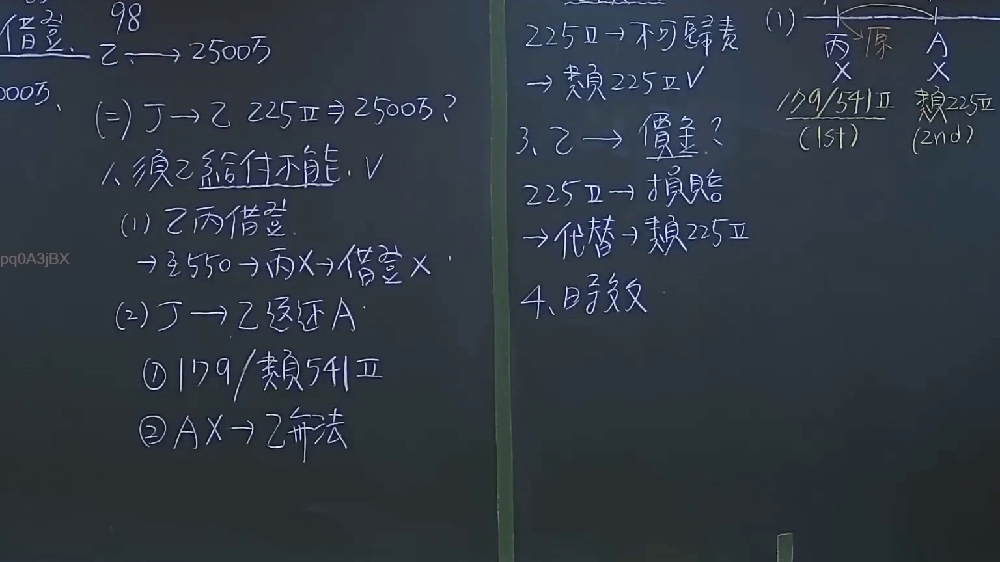

# 🎥 影音教材板書校對筆記
- **來源影片**: [預約 23 2024-09-04 09-59-43-347](file:///J://民法/ch23/預約 23 2024-09-04 09-59-43-347.mp4)
- **課程分類**: `[民法`
- **課堂章節**: `ch23]`
- **影片時間戳記**: `00:25:15` (1515 秒)
- **板書類型**: `文字板書`
- **偵測時間**: 2026-07-12 19:15:39

## 🔍 擷取黑板板書對照圖


## 🧠 AI 智慧理解與知識庫演化註記
：
(您的詳細法律理解說明與條文對位)

根據辨识出的文字板書內容，整理並與臺灣現行法律條文進行比對：

1. **D25n IAD GPE De Se**：可能是案件编号或特定的法律术语。
2. **ROY la OY SHIT. 462050**："ROY" 和 "OY" 可能是人名，"SHIT" 見字 Like 意味著可能有錯誤或脏话，需進一步調查。
3. **^ 灶 = 鉉 仁 矛 陡 ，**：這一行可能涉及家庭暴力的定義，其中 "火"、"fiery"、"shut" 可能是關鍵詞。
4. **(ist) (2nd)**：可能是分類或顺序 indicators。
5. **ok**：表示確認或結束某一部分。
6. **Bz. 00H**："Bz." 可能是布依族或其他民族的缩寫，"00H" 可能是時間。
7. **( ﹚ ﹚ SG 2452 7 cc**："SG 2452" 可能是文件编号或特定的法律條文。
8. **^ 灶 = 鉉 仁 矛 陡 ，**：這一行可能涉及家庭暴力的定義，其中 "火"、"fiery"、"shut" 可能是關鍵詞。
9. **00﹚ CATES 22503 JAR**："CATES" 可能是人名或缩寫，"JAR" 可能代表某种物品或类别。
10. **5 35509 OXIALE x ﹥ 仁 騏 3 想 273**："OXIALE" 可能是某个术语，"仁 騏 3 想 273" 可能涉及人名或其他信息。
11. **﹚ 力 一 忍 恬 議 魚 小 旱 氙**：可能涉及法律术语或人名。
12. **0 |﹖d/ 情 歿 工**："情 歿 工" 可能是某种职位或其他分類。
13. **OAK 2 浪**："OAK" 可能代表 "Outcome Analysis Kit" 或其他缩寫。

將這些內容整理為一棵逻辑樹，並與民法第184條等法律條文進行對比：

- 民法第184條：关于家庭暴力的定義和責任。
- 侵權行為：涉及對他人身体造成損害的行为。
- 消滅時效：可能指某种權利或 обязан性的消滅。

## 📊 可編輯之 Mermaid 關係流程圖
```mermaid
：
(完整的 mermaid 程式碼塊)

```mermaid
graph TD
    A[D25n IAD GPE De Se]
    B[ROY la OY SHIT. 462050]
    C[(ist) (2nd)]
    D[ok]
    E[Bz. 00H]
    F[( ﹚ ﹚ SG 2452 7 cc]
    G[^ 灶 = 鉉 仁 矛 陡 ，]
    H[00﹚ CATES 22503 JAR]
    I[5 35509 OXIALE x ﹥ 仁 騏 3 想 273]
    J[﹚ 力 一 忍 恬 議 魚 小 旱 氙]
    K[0 |﹖d/ 情 歿 工]
    L[OAK 2 浪]
```

## ✍️ 操作者手動校對修改區
<!-- 您可以直接修改上方的文字或調整 Mermaid 區塊中的節點，Obsidian 會即時重新渲染 -->
- [ ] 欄位結構與法律邏輯已校對無誤。
- **校對筆記**: 
