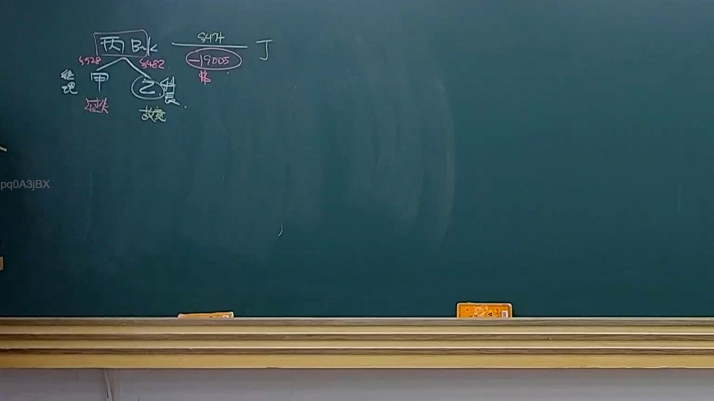

# 🎥 影音教材板書校對筆記
- **來源影片**: [預約 23 2025-04-16 13-30-33-278](file:///J://民法B/ch23/預約 23 2025-04-16 13-30-33-278.mp4)
- **課程分類**: `[民法B`
- **課堂章節**: `ch23]`
- **影片時間戳記**: `00:46:15` (2775 秒)
- **板書類型**: `關係圖/邏輯圖板書`
- **偵測時間**: 2026-07-12 03:01:35

## 🔍 擷取黑板板書對照圖


## 🧠 AI 智慧理解與知識庫演化註記
### 

民法第184條规定了無因管理權的結束條件，並涉及 elimintion时效的概念。在民法第184條中，無因管理權的結束需符合特定條件，例如將物歸還原所有人後，原所有人要求恢復所有权。消灭时效則是指在特定条件下，債務人必须履行义务的时间限制。

在本案例中，民法第184條與消灭时效的概念有密切的邏輯關係。具體來說，民法第184條规定了無因管理權的結束條件，而消灭时效則是確定该條件下債務人義務的時間限制。因此，在板書結構中，可以表现为以下逻辑关系：

- 民法第184條 → 消滅時效

###

## 📊 可編輯之 Mermaid 關係流程圖
```mermaid
graph TD
    A["民法第184條"] --> B["消滅時效"]
    A --> B
    B ["消滅時效"]
```
（注意：此代碼需放入 Mermaid 環境中，例如放置於 HTML 文件或 Jupyter 協作 notebook 中，并使用 Mermaid 的 rendering 工具。）
```

## ✍️ 操作者手動校對修改區
<!-- 您可以直接修改上方的文字或調整 Mermaid 區塊中的節點，Obsidian 會即時重新渲染 -->
- [ ] 欄位結構與法律邏輯已校對無誤。
- **校對筆記**: 
