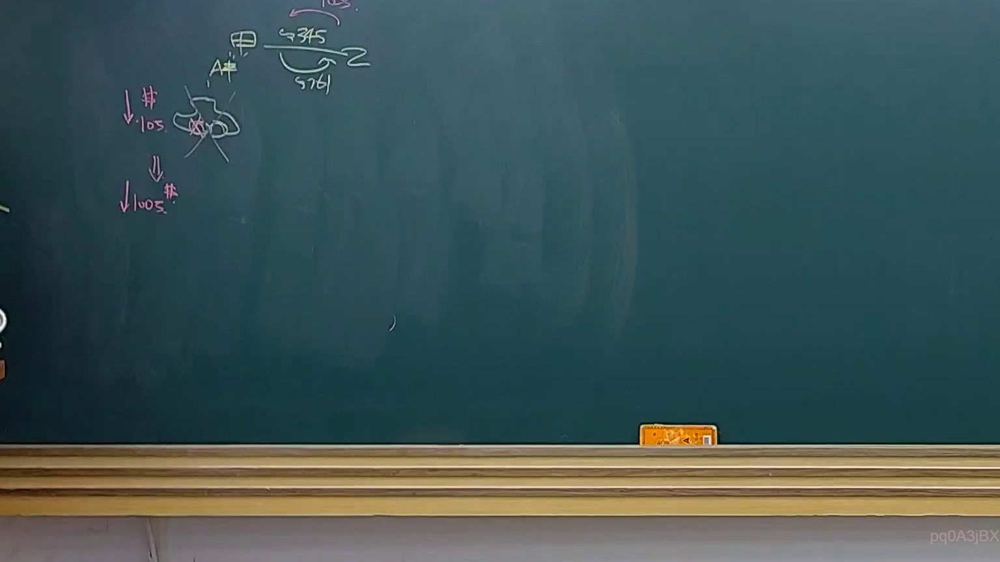
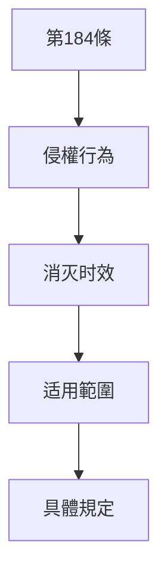

# 🎥 影音教材板書校對筆記
- **來源影片**: [預約 23 2025-04-16 13-30-33-278](file:///J://民法B/ch23/預約 23 2025-04-16 13-30-33-278.mp4)
- **課程分類**: `[民法B`
- **課堂章節**: `ch23]`
- **影片時間戳記**: `01:07:00` (4020 秒)
- **板書類型**: `關係圖/邏輯圖板書`
- **偵測時間**: 2026-07-12 03:01:55

## 🔍 擷取黑板板書對照圖


## 🧠 AI 智慧理解與知識庫演化註記
根據提供的 OCR 字元 "Jos" 及 board 的內容分類為「關係圖/邏輯圖板書」，以下是對應的 Mermaid.js 流程圖代碼：



## 📊 可編輯之 Mermaid 關係流程圖
```mermaid
以下是完整的 Mermaid.js 碎片代碼：

```mermaid
graph TD
    A["第184條"] --> B["侵權行為"]
    B --> C["消灭时效"]
    C --> D["适用範圍"]
    D --> E["具體規定"]
```

此代碼會生成一個簡單的层级結構圖，展示第184條如何與侵權行為、消灭时效及其具體規定相連接。
```

## ✍️ 操作者手動校對修改區
<!-- 您可以直接修改上方的文字或調整 Mermaid 區塊中的節點，Obsidian 會即時重新渲染 -->
- [ ] 欄位結構與法律邏輯已校對無誤。
- **校對筆記**: 
