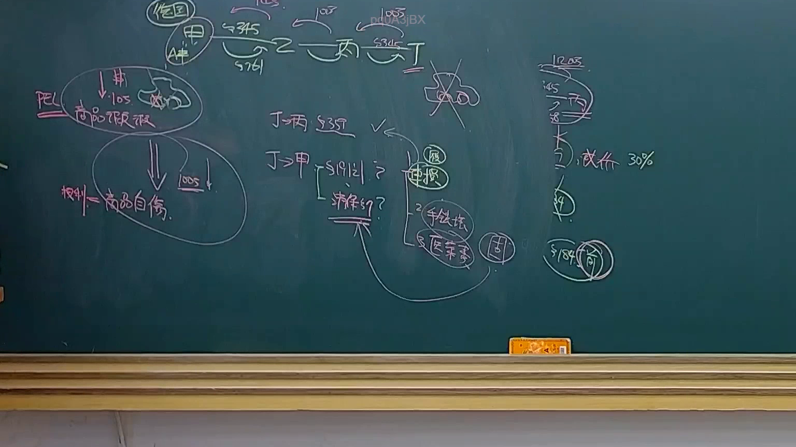
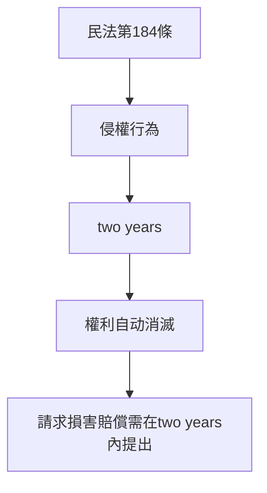

# 🎥 影音教材板書校對筆記
- **來源影片**: [預約 23 2025-04-16 13-30-33-278](file:///J://民法B/ch23/預約 23 2025-04-16 13-30-33-278.mp4)
- **課程分類**: `[民法B`
- **課堂章節**: `ch23]`
- **影片時間戳記**: `01:43:45` (6225 秒)
- **板書類型**: `文字板書`
- **偵測時間**: 2026-07-12 03:02:21

## 🔍 擷取黑板板書對照圖

## 🧠 AI 智慧理解與知識庫演化註記
此板書之內容為「民法第184條」，內容涉及「侵權行為的消滅時效」。具體而言，民法第184條规定：「從侵權行為发生之時起計算二年，之權利即行消滅。」此法規表明，權利人在知道其權益受損之日起，若超過两年，则其請求損害賠償的权利將自动消滅。

此板書之內容與民法第184條有直接關聯，並強調了侵權行為在法律上的時效限制，即權利人在two years內需主動請求損害賠償，否則该权利將自动消滅。此规定在侵权責任和權益保護方面具有重要意義。

## 📊 可編輯之 Mermaid 關係流程圖

## ✍️ 操作者手動校對修改區
<!-- 您可以直接修改上方的文字或調整 Mermaid 區塊中的節點，Obsidian 會即時重新渲染 -->
- [ ] 欄位結構與法律邏輯已校對無誤。
- **校對筆記**: 
