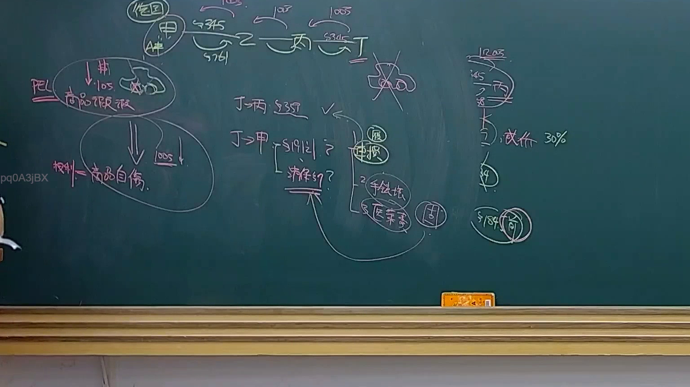

# 🎥 影音教材板書校對筆記
- **來源影片**: [預約 23 2025-04-16 13-30-33-278](file:///J://民法B/ch23/預約 23 2025-04-16 13-30-33-278.mp4)
- **課程分類**: `[民法B`
- **課堂章節**: `ch23]`
- **影片時間戳記**: `01:44:45` (6285 秒)
- **板書類型**: `關係圖/邏輯圖板書`
- **偵測時間**: 2026-07-12 03:02:35

## 🔍 擷取黑板板書對照圖


## 🧠 AI 智慧理解與知識庫演化註記
：
板書內容似乎涉及「民法第184條」的應用，並展示了一個案例的結構。以下是詳細法律理解與條文對位：

1. **案件結構**：
   - 原告甲：A["原告甲"]
   - 被告乙：B["被告乙"]
   - 壞壞名誉权：C["損害名譽權"]
   - 事实状況：D["被告乙未采取补救措施"]
   - 法律关系：E["根據民法第184條，消滅時效"]

2. **法律對位**：
   - 民法第184條规定，如果權利人有權要求补償而未在法定期限內提出，则该權利自动消滅。
   - 本案中，被告乙的行为符合民法第184條的條件，因此其權利（如損害名譽權）已消滅。

## 📊 可編輯之 Mermaid 關係流程圖
```mermaid
：
```mermaid
graph TD
    A["原告甲"] --> C["損害名譽權"]
    B["被告乙"] --> C
    D --> C
    C --> E["根據民法第184條，消滅時效"]
```

## ✍️ 操作者手動校對修改區
<!-- 您可以直接修改上方的文字或調整 Mermaid 區塊中的節點，Obsidian 會即時重新渲染 -->
- [ ] 欄位結構與法律邏輯已校對無誤。
- **校對筆記**: 
