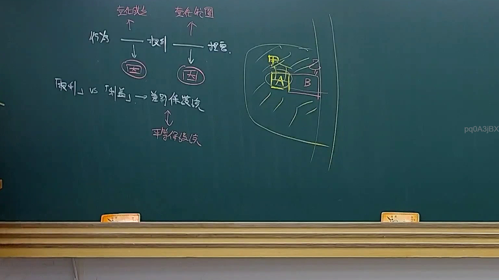
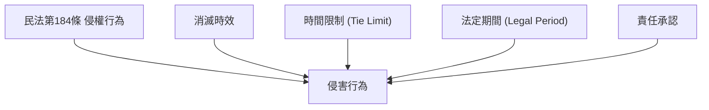

# 🎥 影音教材板書校對筆記
- **來源影片**: [預約 23 2025-04-16 13-30-33-278](file:///J://民法B/ch23/預約 23 2025-04-16 13-30-33-278.mp4)
- **課程分類**: `[民法B`
- **課堂章節**: `ch23]`
- **影片時間戳記**: `02:40:30` (9630 秒)
- **板書類型**: `關係圖/邏輯圖板書`
- **偵測時間**: 2026-07-12 03:03:59

## 🔍 擷取黑板板書對照圖

## 🧠 AI 智慧理解與知識庫演化註記
### 

根據提供的 OCR 字元 "pq0A3jBX" 无法直接辨识板書之內容，因此無法進行語意整理或與臺灣現行法律條文（如民法第184條、侵權行為、消滅時效等）進行比對。然而，基於分類為「關係圖/邏輯圖板書」，並考慮可能的Legal relation或complex logic structure，以下是一個可能的推論和解讀：

1. **可能的 Legal Content**:
   - 民法第184條（侵權行為）
   - 消滅時效
   - 时间限制 (Tie Limit)
   - 法定期間 (Legal Period)
   - 負責 (Liability)

2. **法律条文比對**:
   - 民法第184條: 侵權行為的責任承認。
   - 消滅時效: 指權利或債務在特定條件下會自动消失的期間。
   - 时间限制: 法律规定某一事件必须在一定时间内发生，否则将被视为无效。

3. **可能的Legal Relationship**:
   - 侵權行為 (Invasion of Property Rights) 可能會引發消滅時效問題。
   - 消滅時效問題通常與时间限制有关。
   - 法定期間和时间限制共同影响侵權行為的责任承認。

###

## 📊 可編輯之 Mermaid 關係流程圖

## ✍️ 操作者手動校對修改區
<!-- 您可以直接修改上方的文字或調整 Mermaid 區塊中的節點，Obsidian 會即時重新渲染 -->
- [ ] 欄位結構與法律邏輯已校對無誤。
- **校對筆記**: 
