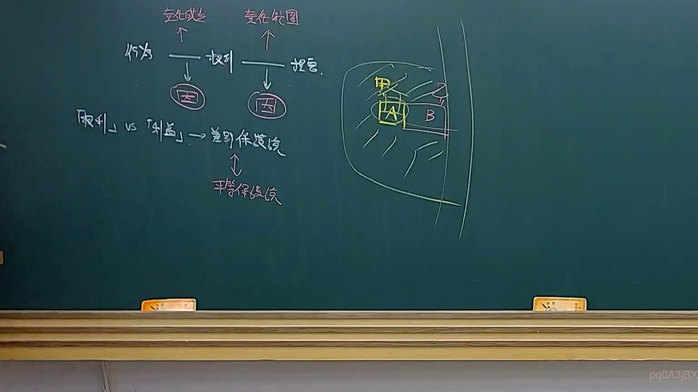
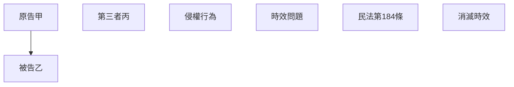

# 🎥 影音教材板書校對筆記
- **來源影片**: [預約 23 2025-04-16 13-30-33-278](file:///J://民法B/ch23/預約 23 2025-04-16 13-30-33-278.mp4)
- **課程分類**: `[民法B`
- **課堂章節**: `ch23]`
- **影片時間戳記**: `02:41:45` (9705 秒)
- **板書類型**: `關係圖/邏輯圖板書`
- **偵測時間**: 2026-07-12 03:04:16

## 🔍 擷取黑板板書對照圖


## 🧠 AI 智慧理解與知識庫演化註記
### 

这段板書似乎涉及「侵權行為」和「消滅時效」的法律概念，並可能與「民法第184條」（超過法定時效的訴訟請求不再受保護）的應用有關。以下是對比分析：

1. **侵權行為**：
   - 被告乙的行为可能构成对原告甲的侵權。
   - 侵權行為的法律效果通常需要一定時間才能顯現，這涉及「時效問題」。

2. **消滅時效**：
   - 消滅時效是指在特定條件下，侵權行為或其影響會自动消失的情形。
   - 可能涉及到「民法第184條」的應用，该條文规定了超過法定時效的訴訟請求不再受保護。

3. **关系圖/邏輯圖板書**：
   - 請告甲 → 被被告乙
   - 被告乙的行为可能涉及第三者丙的共同Tortoise（共同 Tortoise 理論）。
   - 侵權行為的時效問題可能需要考慮「消滅時效」的條件。

###

## 📊 可編輯之 Mermaid 關係流程圖

- 节點A（原告甲）指向节点B（被告乙），表示原告對被告的訴訟請求。
- 节點C（第三者丙）可能涉及共同Tortoise，並與侵權行為D有關。
- 時效問題E可能需要考慮民法第184條F的應用，並可能涉及到消滅時效G的概念。
```

## ✍️ 操作者手動校對修改區
<!-- 您可以直接修改上方的文字或調整 Mermaid 區塊中的節點，Obsidian 會即時重新渲染 -->
- [ ] 欄位結構與法律邏輯已校對無誤。
- **校對筆記**: 
