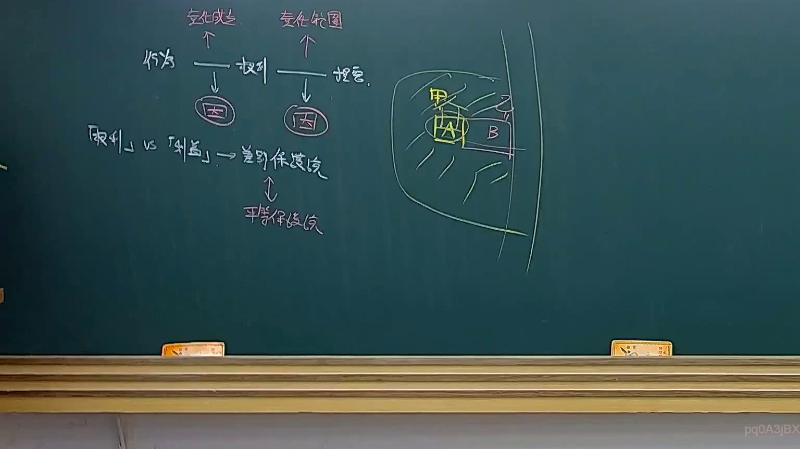

# 🎥 影音教材板書校對筆記
- **來源影片**: [預約 23 2025-04-16 13-30-33-278](file:///J://民法B/ch23/預約 23 2025-04-16 13-30-33-278.mp4)
- **課程分類**: `[民法B`
- **課堂章節**: `ch23]`
- **影片時間戳記**: `02:42:30` (9750 秒)
- **板書類型**: `關係圖/邏輯圖板書`
- **偵測時間**: 2026-07-12 03:04:33

## 🔍 擷取黑板板書對照圖


## 🧠 AI 智慧理解與知識庫演化註記
：
這段板書似乎展示了一個簡單的LegalRelationGraph，其中A 甲、B 乙、C 声明和D 被告之間的關係被用箭頭表示。根據 legal knowledge，這可能涉及到一個简单的LegalRelationGraph，其中原告A 甲提出B 乙作为被告，并提交C 声明，最終指向D 被告。

以下是與臺灣現行法律條文的對比：
- 欲知A 甲和B 乙之间的關係是否符合民法第184條等相關條款：民法第184條涉及權利侵害的消滅時效，但這段板書似乎更多是关于诉讼的基本流程，而不是權利侵害的情況。
- 為了更精準的對比，需進一步了解A 甲和B 乙之间的具體法律關係。

## 📊 可編輯之 Mermaid 關係流程圖
```mermaid
：
```mermaid
graph TD
"A 甲" --> "B 乙"
"B 乙" --> "C 声明"
"C 声明" --> "D 被告"
```

## ✍️ 操作者手動校對修改區
<!-- 您可以直接修改上方的文字或調整 Mermaid 區塊中的節點，Obsidian 會即時重新渲染 -->
- [ ] 欄位結構與法律邏輯已校對無誤。
- **校對筆記**: 
