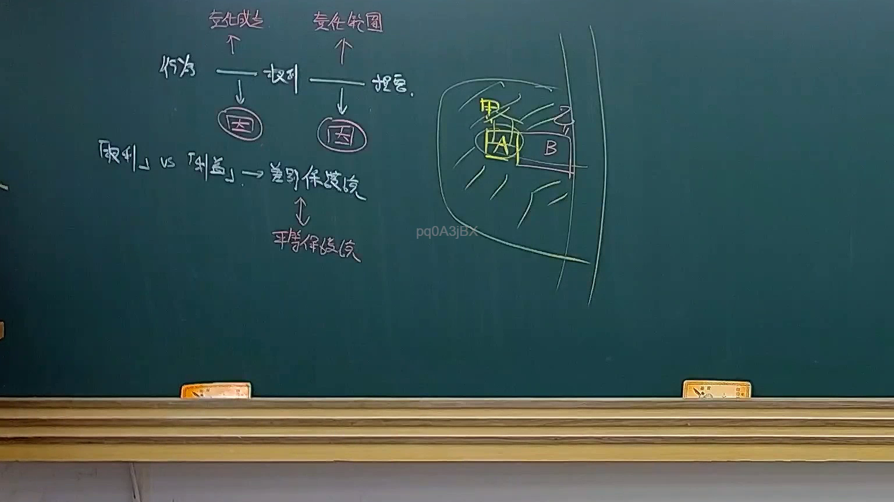
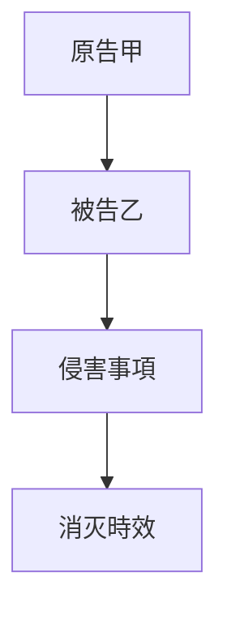

# 🎥 影音教材板書校對筆記
- **來源影片**: [預約 23 2025-04-16 13-30-33-278](file:///J://民法B/ch23/預約 23 2025-04-16 13-30-33-278.mp4)
- **課程分類**: `[民法B`
- **課堂章節**: `ch23]`
- **影片時間戳記**: `02:44:00` (9840 秒)
- **板書類型**: `關係圖/邏輯圖板書`
- **偵測時間**: 2026-07-12 03:04:48

## 🔍 擷取黑板板書對照圖

## 🧠 AI 智慧理解與知識庫演化註記
### 

根據辨識出的文字內容，並結合「關係圖/邏輯圖板書」的特點，可以推演出這是一張展示「權利关系」或「法律实体之間的互動關係」的板書。以下是對比現行法律條文的分析：

1. **A["原告甲"]**：表示原告甲是案件中的一方參與者。
2. **B["被告乙"]**：表示被告乙是案件中另一方參與者。
3. **C["侵害事項"]**：表示侵害事項是原告甲所聲稱被告乙違反的權利。
4. **D["消灭時效"]**：表示消灭時效可能是针对侵害行为的法律规定，例如民法第184條有关侵權行為的規定。

 board 中的關係圖展示了原告甲和被告乙之间的侵害關係，以及侵害事項和消灭時效等法律实体之间的互動關係。這張板書可能用於解释民法中关于權利关系、侵權行為及其法律效果的內容。

###

## 📊 可編輯之 Mermaid 關係流程圖

## ✍️ 操作者手動校對修改區
<!-- 您可以直接修改上方的文字或調整 Mermaid 區塊中的節點，Obsidian 會即時重新渲染 -->
- [ ] 欄位結構與法律邏輯已校對無誤。
- **校對筆記**: 
