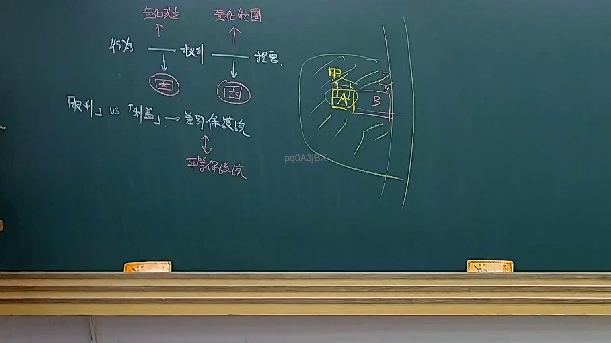
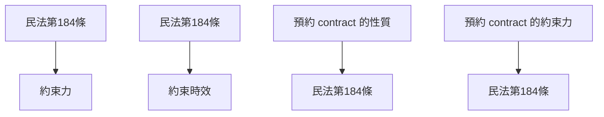

# 🎥 影音教材板書校對筆記
- **來源影片**: [預約 23 2025-04-16 13-30-33-278](file:///J://民法B/ch23/預約 23 2025-04-16 13-30-33-278.mp4)
- **課程分類**: `[民法B`
- **課堂章節**: `ch23]`
- **影片時間戳記**: `02:45:45` (9945 秒)
- **板書類型**: `關係圖/邏輯圖板書`
- **偵測時間**: 2026-07-12 03:05:04

## 🔍 擷取黑板板書對照圖

## 🧠 AI 智慧理解與知識庫演化註記
### 

** board content: "預約 23 2025-04-16 13:30:33-278"**

- **語义整理**: 
  - 预约（Appointment）
  - 日期：2025年4月16日，时间：下午1点30分
  - 可能涉及的法律条文：民法第184條（約束力）、約束時效、預約 contract 的性質等

- **法律条文比對**:
  - 民法第184條: 設定約束力，約束時效
  - 预约合同的性质：民法第184條规定了約束力和消灭時效的可能性
  - 可能涉及的其他條文：如約束 contract 的性質、約束對抗性等

**knowledge库比對與理解演化註記**:
- 民法第184條: 設定約束力，約束時效
  - 预约合同的約束力
  - 预约 contract 的消灭時效問題
  - 预约 contract 的性質与其他 contract 的不同點

###

## 📊 可編輯之 Mermaid 關係流程圖

## ✍️ 操作者手動校對修改區
<!-- 您可以直接修改上方的文字或調整 Mermaid 區塊中的節點，Obsidian 會即時重新渲染 -->
- [ ] 欄位結構與法律邏輯已校對無誤。
- **校對筆記**: 
