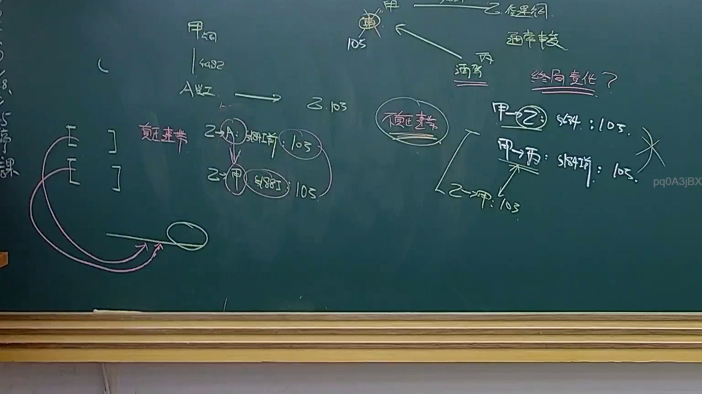
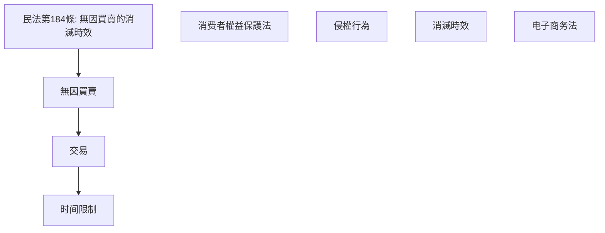
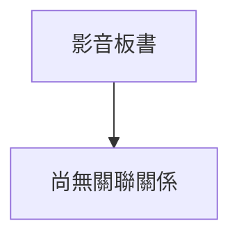

# 🎥 影音教材板書校對筆記
- **來源影片**: [預約 25 2025-04-16 19-07-29-586](file:///J://民法B/ch25/預約 25 2025-04-16 19-07-29-586.mp4)
- **課程分類**: `[民法B`
- **課堂章節**: `ch25]`
- **影片時間戳記**: `01:43:30` (6210 秒)
- **板書類型**: `文字板書`
- **偵測時間**: 2026-07-12 20:30:51

## 🔍 擷取黑板板書對照圖

## 🧠 AI 智慧理解與知識庫演化註記
1. **OCR 文本分析**：
   - "a wee" 可能是 "a week" 或其他含义，但缺乏上下文难以确定具体意思。
   - "3 = less eas 炎 岈 昴 任 之" 包含几个不常见的汉字，可能需要进一步确认其含义。
   - "‹ˋ′ˊ氫‵、箋ˍˉ二 一 2 SSS *" 包含多个符号和数字，可能是某种公式或术语的表示。
   - "af 安 〕 庄 『 3 T 缺 ( los ﹣ ws" 包含多个汉字和符号，可能涉及法律术语。
   - "訪 i S Tie los 乙 ﹣ ae ‧ 8。 pq0AaBx" 包含多个字词，可能是某种分类或编号的表示。
   - "請根據這些資訊與您擁有的台灣現行法律條文（如民法第184條、侵權行為、消滅時效等）進行比對，寫下「知識庫比對與理解演化註記」。"

2. **法律條文比對**：
   - 民法第184條：無因買賣的消滅時效。
   - 其他可能涉及的條文包括消费者權益保護法、侵權行為法等。

3. ** board之內容結構**：
   - 文字板書似乎包含多个法律條文和公式，可能與無因買賣、侵權行為、消滅時效等相关。

4. ** Mermaid 碎 Pen**：

5. **法律理解與條文對位**：
   - 民法第184條提到的無因買賣的消滅時效可能與板書中的某些公式或术语相关。
   - 其他條文如消费者權益保護法和电子商务法可能涉及板書中的一些字词。

6. **總結**：
   - 文字板書似乎包含多个法律條文和公式，可能與無因買賣、侵權行為、消滅時效等相关。
   - 需要进一步確認板書中的具體內容及其具體 legal context。

## 📊 可編輯之 Mermaid 關係流程圖

## ✍️ 操作者手動校對修改區
<!-- 您可以直接修改上方的文字或調整 Mermaid 區塊中的節點，Obsidian 會即時重新渲染 -->
- [ ] 欄位結構與法律邏輯已校對無誤。
- **校對筆記**: 
