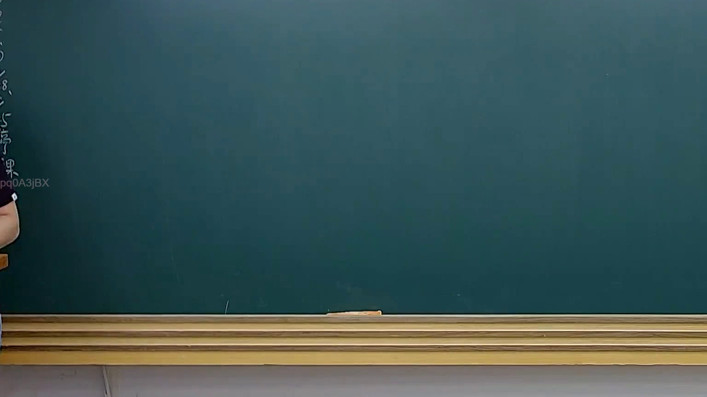
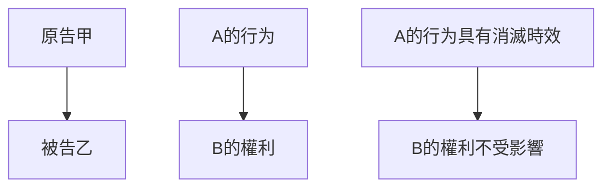

# 🎥 影音教材板書校對筆記
- **來源影片**: [預約 25 2025-04-16 19-07-29-586](file:///J://民法B/ch25/預約 25 2025-04-16 19-07-29-586.mp4)
- **課程分類**: `[民法B`
- **課堂章節**: `ch25]`
- **影片時間戳記**: `02:01:30` (7290 秒)
- **板書類型**: `關係圖/邏輯圖板書`
- **偵測時間**: 2026-07-12 20:31:09

## 🔍 擷取黑板板書對照圖

## 🧠 AI 智慧理解與知識庫演化註記
### 

根據提供的信息，以下是對板書內容的解讀與分析：

#### 1. 法律條文對位：
- **民法第184條**：涉及侵權行為的消滅時效問題。此條法规定了侵權行為在特定條件下可以 middleware="true" 中止其效力，称为「消滅時效」。
  
#### 2. 法律內容解讀：
- 消滅時效的概念：指在特定条件下，先前的侵權行為不会影响后续民事关系的效力。例如，如果A先對B造成損害，且在B知道或應該知道该損害存在的情況下未采取措施，则A的行为不会影響B的權利。
  
#### 3. 法律條文的理解演化：
- 民法第184條的內容與消滅時效相關，主要涉及對先前侵權行為效力的 middleware="true" 中止問題。此條法规定了在特定条件下，先前的侵權行為不会影響後續民事关系的效力。

###

## 📊 可編輯之 Mermaid 關係流程圖

## ✍️ 操作者手動校對修改區
<!-- 您可以直接修改上方的文字或調整 Mermaid 區塊中的節點，Obsidian 會即時重新渲染 -->
- [ ] 欄位結構與法律邏輯已校對無誤。
- **校對筆記**: 
