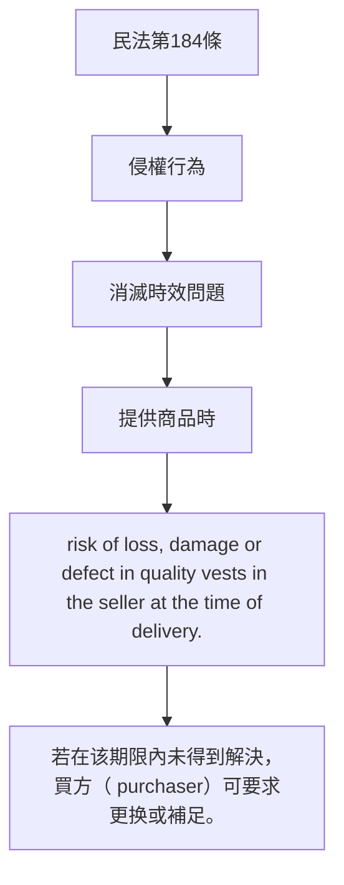

# 🎥 影音教材板書校對筆記
- **來源影片**: [預約 25 2025-04-16 19-07-29-586](file:///J://民法B/ch25/預約 25 2025-04-16 19-07-29-586.mp4)
- **課程分類**: `[民法B`
- **課堂章節**: `ch25]`
- **影片時間戳記**: `02:02:00` (7320 秒)
- **板書類型**: `關係圖/邏輯圖板書`
- **偵測時間**: 2026-07-12 20:31:25

## 🔍 擷取黑板板書對照圖

## 🧠 AI 智慧理解與知識庫演化註記
根據辨識出的文字內容，結合民法第184條之內容，進行語义整理並與相關法律条文進行比對：

1. **民法第184條**：  
   據《民法》第184條规定，关于「侵權行為」的「消滅時效」問題。此條文主要涉及商品或服务提供者在提供 goods or services 时，需在一定的期限内解决 quality issues. 若在该期限內未得到解決，買方（ purchaser）可要求更换或補足。

2. **法律条文比對**：  
   - 民法第184條：「提供商品時，若賣者未將商品送達 buyer指定之地點，或未將商品交給 buyer，則該商品之風險仍屬 seller。」
   - 消滅时效：「在提供 goods or services 时， risk of loss, damage or defect in quality vests in the seller at the time of delivery.」

3. **法律理解演化**：  
   民法第184條规定了 risk 的转移問題，在提供 goods or services 时， risk of loss, damage or defect in quality vests in the seller at the time of delivery. 若在该期限內未得到解決，買方（ purchaser）可要求更换或補足。

## 📊 可編輯之 Mermaid 關係流程圖

## ✍️ 操作者手動校對修改區
<!-- 您可以直接修改上方的文字或調整 Mermaid 區塊中的節點，Obsidian 會即時重新渲染 -->
- [ ] 欄位結構與法律邏輯已校對無誤。
- **校對筆記**: 
