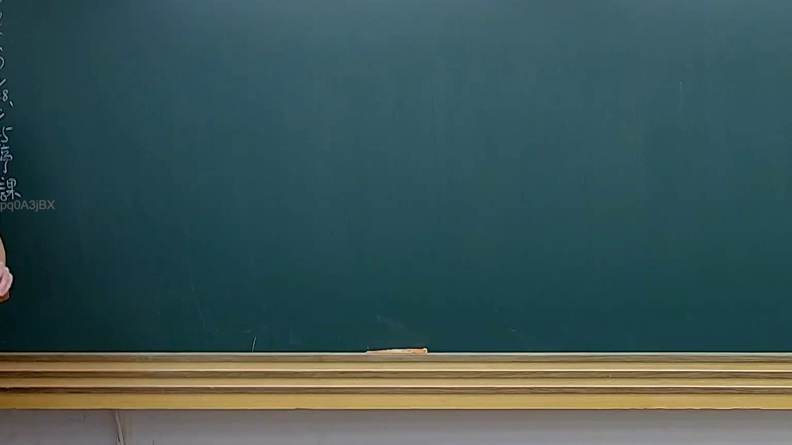

# 🎥 影音教材板書校對筆記
- **來源影片**: [預約 25 2025-04-16 19-07-29-586](file:///J://民法B/ch25/預約 25 2025-04-16 19-07-29-586.mp4)
- **課程分類**: `[民法B`
- **課堂章節**: `ch25]`
- **影片時間戳記**: `02:03:15` (7395 秒)
- **板書類型**: `文字板書`
- **偵測時間**: 2026-07-12 20:31:38

## 🔍 擷取黑板板書對照圖


## 🧠 AI 智慧理解與知識庫演化註記
：
根據OCR辨识結果，“oe c a Shas — s”似乎無法直接对应到臺灣現行法律條文（如民法第184條、侵權行為、消滅時效等）。可能需要進一步確認文字內容或提供更清晰的OCR辨识結果。

## 📊 可編輯之 Mermaid 關係流程圖
```mermaid
：
因 OCR 機能识别的文字内容无法明确对应到任何法律条文或逻辑结构，因此無法生成相應的 Mermaid 確定圖代码。請提供更清晰的文字內容或相關上下文信息以便進一步分析。
```

## ✍️ 操作者手動校對修改區
<!-- 您可以直接修改上方的文字或調整 Mermaid 區塊中的節點，Obsidian 會即時重新渲染 -->
- [ ] 欄位結構與法律邏輯已校對無誤。
- **校對筆記**: 
