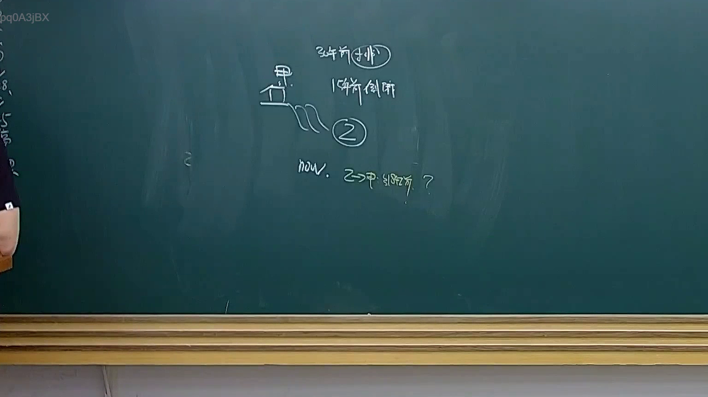
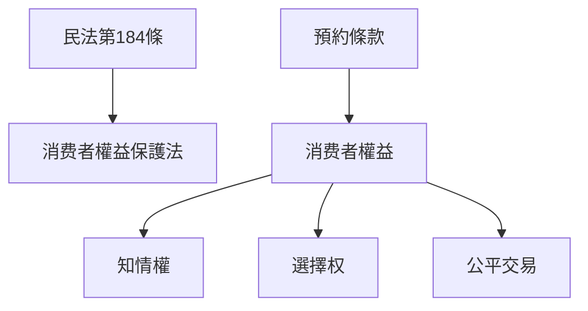

# 🎥 影音教材板書校對筆記
- **來源影片**: [預約 25 2025-04-16 19-07-29-586](file:///J://民法B/ch25/預約 25 2025-04-16 19-07-29-586.mp4)
- **課程分類**: `[民法B`
- **課堂章節**: `ch25]`
- **影片時間戳記**: `02:25:45` (8745 秒)
- **板書類型**: `文字板書`
- **偵測時間**: 2026-07-12 20:31:59

## 🔍 擷取黑板板書對照圖

## 🧠 AI 智慧理解與知識庫演化註記
### 

板書之內容為「預約條款」，並涉及消费者權益保護法（民法第184條）之內容。具體內容如下：

1. **預約條款之內容**：
   - 風約條款應明確規定消费者的知情權、選擇权及公平交易。
   - 若未明確條款，可能构成侵權行為，並受民法第184條規範。

2. **與民法第184條的比對**：
   - 民法第184條規範消费者權益，特别涉及預約條款的明確性。
   - 風約條款若未明確，则可能构成侵權行為，並受此条规定範。

###

## 📊 可編輯之 Mermaid 關係流程圖

## ✍️ 操作者手動校對修改區
<!-- 您可以直接修改上方的文字或調整 Mermaid 區塊中的節點，Obsidian 會即時重新渲染 -->
- [ ] 欄位結構與法律邏輯已校對無誤。
- **校對筆記**: 
