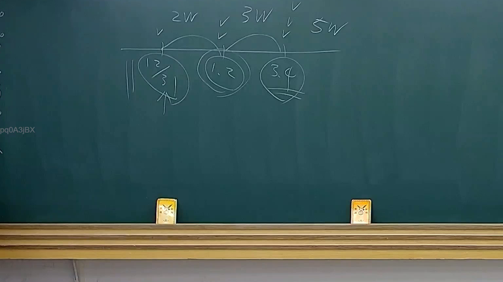
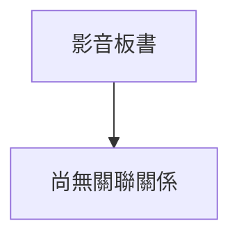

# 🎥 影音教材板書校對筆記
- **來源影片**: [預約 25 2025-08-01 13-56-26-823](file:///J://行政法A/ch25/預約 25 2025-08-01 13-56-26-823.mp4)
- **課程分類**: `[行政法A`
- **課堂章節**: `ch25]`
- **影片時間戳記**: `00:09:30` (570 秒)
- **板書類型**: `關係圖/邏輯圖板書`
- **偵測時間**: 2026-07-13 10:13:18

## 🔍 擷取黑板板書對照圖

## 🧠 AI 智慧理解與知識庫演化註記
：

您好！您提供的 OCR 辨識字元區域為空白（「擷取區域的 OCR 辨識字元如下：」之後沒有實際文字內容）。我無法在缺乏具體板書文字的基礎上進行法律條文比對或生成 Mermaid 流程圖。

請提供該時間點（9分30秒）截圖中老師實際寫下的板書文字，例如：
- 具體的法律概念名稱（如「侵權行為」、「消滅時效」等）
- 關係圖中的節點文字與箭頭邏輯
- 任何條文編號或關鍵詞

一旦收到完整 OCR 內容，我將立即為您完成：
1. **知識庫比對**：與民法第184條、侵權行為責任、消滅時效等現行條文進行語意對位分析。
2. **Mermaid 代碼生成**：根據板書邏輯結構輸出完整的 Mermaid.js 流程圖（含雙引號包裹的節點文字）。

期待您的補充資料！

## 📊 可編輯之 Mermaid 關係流程圖

## ✍️ 操作者手動校對修改區
<!-- 您可以直接修改上方的文字或調整 Mermaid 區塊中的節點，Obsidian 會即時重新渲染 -->
- [ ] 欄位結構與法律邏輯已校對無誤。
- **校對筆記**: 
