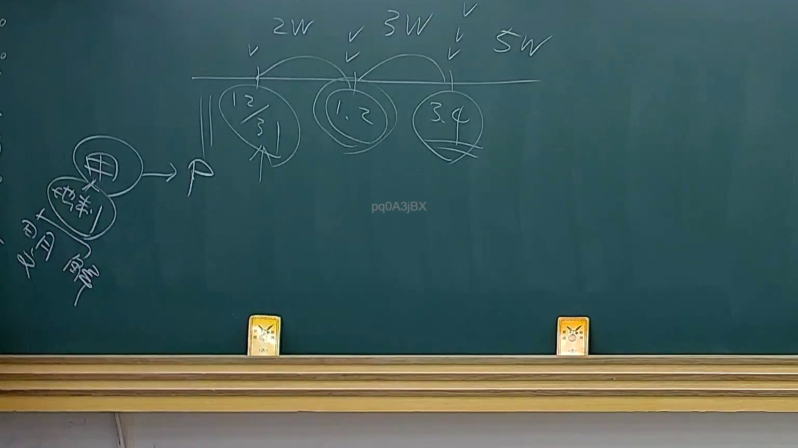
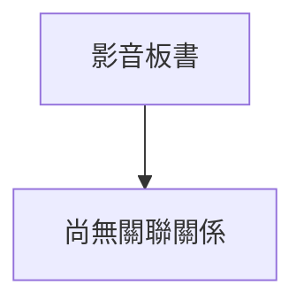

# 🎥 影音教材板書校對筆記
- **來源影片**: [預約 25 2025-08-01 13-56-26-823](file:///J://行政法A/ch25/預約 25 2025-08-01 13-56-26-823.mp4)
- **課程分類**: `[行政法A`
- **課堂章節**: `ch25]`
- **影片時間戳記**: `00:15:00` (900 秒)
- **板書類型**: `關係圖/邏輯圖板書`
- **偵測時間**: 2026-07-13 10:13:36

## 🔍 擷取黑板板書對照圖

## 🧠 AI 智慧理解與知識庫演化註記
：
您好，您提供的訊息中「擷取區域的 OCR 辨識字元如下：」之後**未附實際的文字內容**。目前無法進行語意整理、條文比對或生成 Mermaid 代碼。

請將老師板書上的 OCR 辨識文字貼上，我將立即為您完成以下工作：
1. 語意整理與臺灣現行法律條文（如民法第184條侵權行為責任、消滅時效等）比對註記
2. 依分類生成對應的 Mermaid.js 流程圖代碼

期待您的補充！

## 📊 可編輯之 Mermaid 關係流程圖

## ✍️ 操作者手動校對修改區
<!-- 您可以直接修改上方的文字或調整 Mermaid 區塊中的節點，Obsidian 會即時重新渲染 -->
- [ ] 欄位結構與法律邏輯已校對無誤。
- **校對筆記**: 
