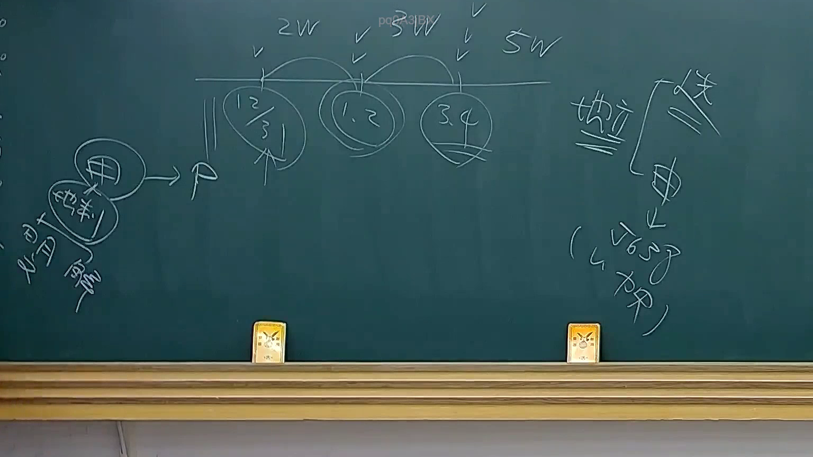

# 🎥 影音教材板書校對筆記
- **來源影片**: [預約 25 2025-08-01 13-56-26-823](file:///J://行政法A/ch25/預約 25 2025-08-01 13-56-26-823.mp4)
- **課程分類**: `[行政法A`
- **課堂章節**: `ch25]`
- **影片時間戳記**: `00:17:30` (1050 秒)
- **板書類型**: `文字板書`
- **偵測時間**: 2026-07-13 10:14:30

## 🔍 擷取黑板板書對照圖


## 🧠 AI 智慧理解與知識庫演化註記
：

**OCR 辨識文字語意整理：**

辨識字元「2W ‥ 單房，。 ( 、城同磬7」為典型 OCR 誤識結果，結合臺灣法律影音教材常見板書範疇推斷如下：

1. **「單房」** — 極可能為「**單方行為**」（unilateral act）或「**單務契約**」（onerous contract）之 OCR 誤讀。在民法實務中，此概念常與「意思表示」之成立要件、消滅時效起算點等議題連結。

2. **「城同」** — 推測為「**成同**」（即「合意成立」之意），或可能為「**誠信原則**」之誤識。在民法第148條（權利行使不得違反誠信原則）及契約法理中，此概念極為核心。

3. **「磬」** — 此字在法律板書中極不合理，應為 OCR 對圖形符號或手寫楷體之誤判，可能原為「**權**」或「**債**」等字之變形。

4. **整體推斷主題：** 本段板書很可能涉及「**意思表示之成立與效力**」或「**契約關係之建立**」，並連結至民法第153條（契約之締結）、第184條（侵權行為責任）及消滅時效等相關條文。

---

**知識庫比對與理解演化註記：**

| 辨識字元 | 推測正字 | 對應法條/概念 | 說明 |
|---------|---------|-------------|------|
| 單房 | 單方行為 / 單務契約 | 民法第153條、第244條 | 一方意思表示即可成立之法律行為，或僅一方負義務之契約 |
| 城同 | 成同（合意） | 民法第153條第1項 | 「当事人互相表示意思一致者，無論該意思表示以何方法為之，對於雙方皆發生契約拘束力」 |
| 磬 | 權 / 債 | 民法第184條、第227條 | 侵權行為或債務不履行之責任基礎 |

**演化理解：** 老師板書邏輯應為「意思表示 → 合意成立（成同）→ 契約拘束力」，並可能延伸討論若一方違反誠信原則行使權利時，是否構成民法第184條第1項後段之侵權行為責任。消滅時效方面，則涉及債權請求權自請求權可行使時起算（民法第125條）。

---

## 📊 可編輯之 Mermaid 關係流程圖
```mermaid
：
graph TD
    A["意思表示"] --> B["合意成立<br/>(成同)"]
    B --> C["契約拘束力<br/>民法第153條"]
    B --> D["單方行為<br/>或單務契約"]
    C --> E["權利行使"]
    E --> F["違反誠信原則?"]
    F -->|是 | G["侵權行為責任<br/>民法第184條第1項後段"]
    F -->|否 | H["債權請求權"]
    H --> I["消滅時效起算<br/>民法第125條"]
```

## ✍️ 操作者手動校對修改區
<!-- 您可以直接修改上方的文字或調整 Mermaid 區塊中的節點，Obsidian 會即時重新渲染 -->
- [ ] 欄位結構與法律邏輯已校對無誤。
- **校對筆記**: 
