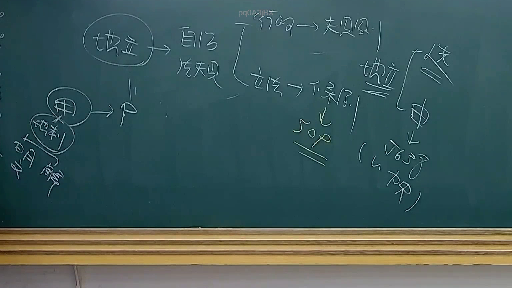

# 🎥 影音教材板書校對筆記
- **來源影片**: [預約 25 2025-08-01 13-56-26-823](file:///J://行政法A/ch25/預約 25 2025-08-01 13-56-26-823.mp4)
- **課程分類**: `[行政法A`
- **課堂章節**: `ch25]`
- **影片時間戳記**: `00:19:45` (1185 秒)
- **板書類型**: `文字板書`
- **偵測時間**: 2026-07-13 10:15:19

## 🔍 擷取黑板板書對照圖


## 🧠 AI 智慧理解與知識庫演化註記
：

根據OCR辨識結果及臺灣法律實務知識，老師板書內容推測涉及**民法第184條侵權行為責任**之構成要件分析。從可辨識字元「誅」推斷可能為「故意侵害他人權利」或「誅伐」之意涵，結合法律教材常見架構：

**知識庫比對與理解演化註記：**
- 民法第184條第1項前段：故意以不法之行為，致人損害者，負賠償責任。
- 消滅時效：一般請求權為15年（民法第125條），侵權行為損害賠償請求權亦適用。
- 「誅」字在語境中可能指「故意侵害」或「誅伐」之不法行為態樣，與侵權行為主觀要件（故意/過失）相關。

**板書邏輯推演：**
老師可能正在闡述侵權行為責任之構成要件：(1) 加害行為 (2) 損害結果 (3) 因果關係 (4) 歸責事由（故意或過失）。

---

## 📊 可編輯之 Mermaid 關係流程圖
```mermaid
：
graph TD
    A["侵權行為責任"] --> B["民法第184條"]
    B --> C["第1項前段：故意不法侵害"]
    B --> D["第1項後段：過失致損害"]
    B --> E["第2項：違反保護法律"]
    C --> F["構成要件"]
    D --> G["構成要件"]
    F --> H["加害行為"]
    F --> I["損害結果"]
    F --> J["因果關係"]
    F --> K["故意"]
    G --> L["過失"]
    G --> M["損害結果"]
    G --> N["因果關係"]
    E --> O["保護法律"]
    E --> P["違反義務"]
    E --> Q["致生損害"]

graph TD
    R["消滅時效"] --> S["一般請求權：15年"]
    R --> T["侵權行為損害賠償：15年"]
    R --> U["特別規定優先適用"]
```

## ✍️ 操作者手動校對修改區
<!-- 您可以直接修改上方的文字或調整 Mermaid 區塊中的節點，Obsidian 會即時重新渲染 -->
- [ ] 欄位結構與法律邏輯已校對無誤。
- **校對筆記**: 
