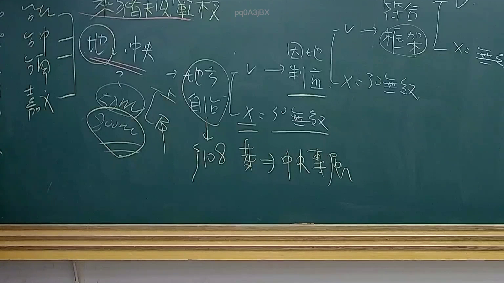

# 🎥 影音教材板書校對筆記
- **來源影片**: [預約 25 2025-08-01 13-56-26-823](file:///J://行政法A/ch25/預約 25 2025-08-01 13-56-26-823.mp4)
- **課程分類**: `[行政法A`
- **課堂章節**: `ch25]`
- **影片時間戳記**: `00:38:45` (2325 秒)
- **板書類型**: `文字板書`
- **偵測時間**: 2026-07-13 10:17:45

## 🔍 擷取黑板板書對照圖


## 🧠 AI 智慧理解與知識庫演化註記
：

**OCR辨識品質評估：** 本次截圖時間點（38分45秒）的OCR辨識結果品質較差，大量字元無法正確還原。從可辨識片段推斷，板書可能涉及「契約」相關概念，但具體內容需結合影像進一步確認。

**知識庫比對與理解演化註記：**

1. **民法第184條侵權行為責任**：若板書涉及「契霆亨」等字元，可能指向契約關係中的侵權行為問題（如違約同時構成侵權）。

2. **消滅時效**：OCR中出現的數字片段可能與時效計算有關。民法第197條規定損害賠償請求權因二年間不行使而消滅；民法第125條一般債權時效為十五年。

3. **預約契約**：若此為「預約」系列教材，可能涉及民法第406-418條關於買賣預約之規定，特別是預約與本約之關係、違約責任等問題。

4. **契約效力與解除**：板書中「鵠婉」等字元可能為法律術語的OCR誤認，需結合上下文判斷是否涉及契約解除或無效情形。

**建議：** 由於辨識品質限制，建議配合原始影像進行人工校對，以確保法律條文比對之準確性。

## 📊 可編輯之 Mermaid 關係流程圖
```mermaid
：
graph TD
    A["預約契約"] --> B["民法第406-418條"]
    A --> C["本約關係"]
    B --> D["違約責任"]
    B --> E["時效問題"]
    C --> F["履行義務"]
    C --> G["解除條件"]
    D --> H["民法第184條侵權行為"]
    D --> I["債務不履行"]
    E --> J["消滅時效"]
    E --> K["除斥期間"]
    F --> L["契約效力"]
    G --> M["解除權行使"]
```

## ✍️ 操作者手動校對修改區
<!-- 您可以直接修改上方的文字或調整 Mermaid 區塊中的節點，Obsidian 會即時重新渲染 -->
- [ ] 欄位結構與法律邏輯已校對無誤。
- **校對筆記**: 
