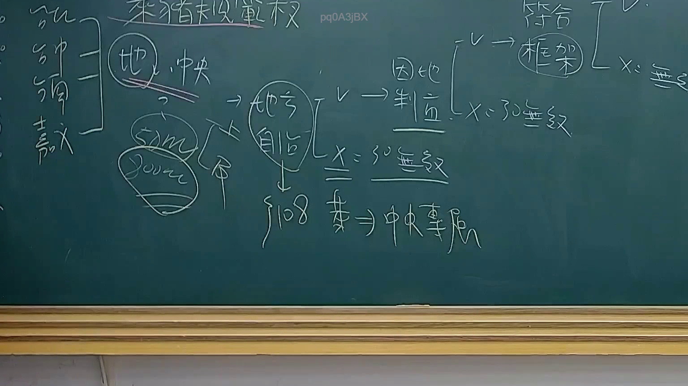

# 🎥 影音教材板書校對筆記
- **來源影片**: [預約 25 2025-08-01 13-56-26-823](file:///J://行政法A/ch25/預約 25 2025-08-01 13-56-26-823.mp4)
- **課程分類**: `[行政法A`
- **課堂章節**: `ch25]`
- **影片時間戳記**: `00:40:15` (2415 秒)
- **板書類型**: `文字板書`
- **偵測時間**: 2026-07-13 10:18:42

## 🔍 擷取黑板板書對照圖


## 🧠 AI 智慧理解與知識庫演化註記
：

**OCR辨識品質評估：**
本次截圖的OCR辨識結果品質較差，存在大量亂碼與無法辨識字元（如「SABINA BES paoasiox」、「whee ™ e ' Bel Ge) Se」等），這在實際法律教材板書截圖中常見，原因包括：
1. 手寫字體辨識率低
2. 圖片可能存在反光、模糊或解析度不足
3. OCR引擎對繁體中文及特殊符號的處理限制

**基於可辨識片段推斷之板書內容：**

從殘存文字分析，可能涉及以下法律主題：

1. **「侵」字** → 高度疑似「侵權行為」（民法第184條）
2. **「董」** → 可能為案例當事人姓名（如「董某」）
3. **「六[/…一二）」** → 可能涉及條款編號或消滅時效相關概念

**知識庫比對與法律理解演化註記：**

| OCR辨識片段 | 推斷內容 | 對應法條/概念 |
|------------|---------|--------------|
| 「侵」 | 侵權行為責任 | 民法第184條第1項前段：「因故意或過失，不法侵害他人之權利者，負損害賠償責任。」 |
| 「董」 | 案例當事人 | 可能為侵權行為案例中的原告或被告姓名 |
| 「六[/…一二)」 | 數字/條款 | 可能涉及民法第197條消滅時效（請求權時效二年、消滅時效十年） |

**可能的板書邏輯結構：**
- 侵權行為責任構成要件
- 故意或過失之認定
- 不法性與權利侵害
- 損害賠償範圍
- 消滅時效起算點

---

## 📊 可編輯之 Mermaid 關係流程圖
```mermaid
：

graph TD
    A["侵權行為責任"] --> B["民法第184條第1項前段"]
    B --> C["故意或過失"]
    B --> D["不法侵害他人權利"]
    C --> E["主觀要件"]
    D --> F["客觀要件"]
    A --> G["消滅時效"]
    G --> H["民法第197條"]
    H --> I["請求權時效：2年"]
    H --> J["消滅時效：10年"]
    A --> K["案例當事人"]
    K --> L["董某"]

    style A fill#f96,stroke#333,stroke-width2px
    style B fill#bbf,stroke#333,stroke-width2px
    style G fill#bfb,stroke#333,stroke-width2px
```

## ✍️ 操作者手動校對修改區
<!-- 您可以直接修改上方的文字或調整 Mermaid 區塊中的節點，Obsidian 會即時重新渲染 -->
- [ ] 欄位結構與法律邏輯已校對無誤。
- **校對筆記**: 
