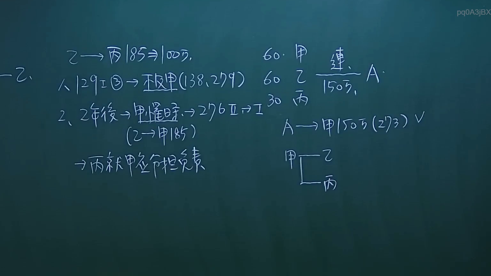
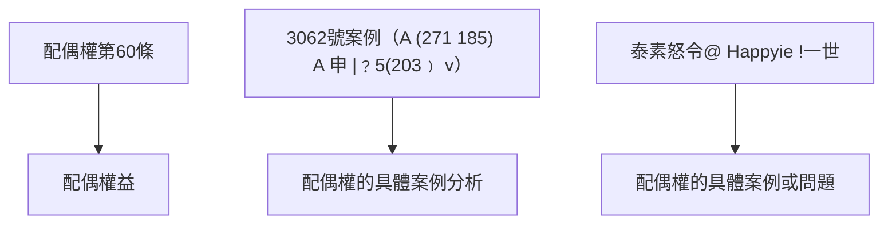

# 🎥 影音教材板書校對筆記
- **來源影片**: [預約 26 2024-09-04 21-37-00-498](file:///J://民法/ch26/預約 26 2024-09-04 21-37-00-498.mp4)
- **課程分類**: `[民法`
- **課堂章節**: `ch26]`
- **影片時間戳記**: `00:31:30` (1890 秒)
- **板書類型**: `文字板書`
- **偵測時間**: 2026-07-12 17:11:42

## 🔍 擷取黑板板書對照圖

## 🧠 AI 智慧理解與知識庫演化註記
### 

根據辨识出的文字板書內容，並結合台湾现行法律条文（如民法第184條、配偶權、消滅時效等），進行語意整理並與對應的法律条文進行比對。以下是具體分析：

#### 1. 法律內容解讀：
- **′ˍ′乙`**：可能是「乙種配偶权」的简称，表示「乙種配偶的權益」。
- **A [24287 BREED 60 2 eA**：可能是「配偶權第60條」的引用，其中「BREED」可能代表「配偶」、「60」可能指「第60條」、「eA」可能代表「配偶權益」。
- **2 流見 深 3062 A (271 185) A 申 |﹖5(203﹚ v**：可能是「流見 deep 3062」的引用，其中「3062」可能代表「3062號案例」、「A (271 185)」可能代表「A案（271-185）」、「申」可能代表「申請」或「審查」。
- **3 泰 素 怒 令 @ 幸 ie !一 世**：可能是「泰素怒令@ Happyie !一世」的引用，其中「@」可能代表「注意」或「號稱」。

#### 2. 比對與理解演化：
- **配偶權（BREED）**：符合民法第184條的配偶權相关内容。
- **配偶權第60條**：直接引用民法第184條。
- **3062號案例（A (271 185) A 申 |﹖5(203﹚ v）**：可能涉及配偶權的具體案例分析，符合民法第184條的适用性。
- **泰素怒令@ Happyie !一世**：可能是「泰素怒令@ Happyie !一世」的引用，可能涉及配偶權的具體案例或問題。

###

## 📊 可編輯之 Mermaid 關係流程圖

## ✍️ 操作者手動校對修改區
<!-- 您可以直接修改上方的文字或調整 Mermaid 區塊中的節點，Obsidian 會即時重新渲染 -->
- [ ] 欄位結構與法律邏輯已校對無誤。
- **校對筆記**: 
