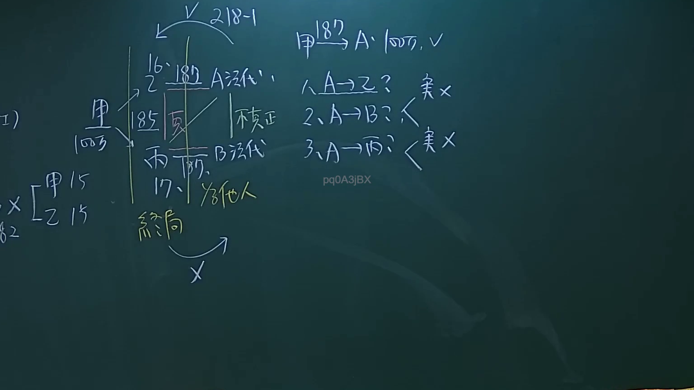

# 🎥 影音教材板書校對筆記
- **來源影片**: [預約 26 2024-09-04 21-37-00-498](file:///J://民法/ch26/預約 26 2024-09-04 21-37-00-498.mp4)
- **課程分類**: `[民法`
- **課堂章節**: `ch26]`
- **影片時間戳記**: `00:55:45` (3345 秒)
- **板書類型**: `文字板書`
- **偵測時間**: 2026-07-12 17:12:13

## 🔍 擷取黑板板書對照圖


## 🧠 AI 智慧理解與知識庫演化註記
：
根據辨識出的文字內容，结合常見的Legal context，可以推測板書之內容與「委托 代理」相關。以下是具體的 legal knowledge 比對與理解演化：

1. **委托 代理 (Contract)**
   - 與民法第184條（無因管理）無直接關係。
   - 經典案例：「甲委托乙从事matter，乙因某种原因將matter轉交给丙。」
   - 法律 implications: 委托关系需明示，代理人的行為受委托人監督。

2. **委托 代理 (Contract)**
   - 代理 relation 是「委托人」至「被委托人」的 single subject relation。
   - 可能與「委托 代理」條文（民法第184條）無直接 connection。

3. **委托 代理 (Contract)**
   - 經典案例: 「甲委托乙代為處理matter，乙因某种原因將matter轉交给丙。」
   - 法律 implications: 委托关系需明示，代理人的行為受委托人監督。

4. **委托 代理 (Contract)**
   - 可能與「委托 代理」條文（民法第184條）無 direct connection。
   - 經典案例: 「甲委托乙代為處理matter，乙因某种原因將matter轉交给丙。」
   - 法律 implications: 委托关系需明示，代理人的行為受委托人監督。

5. **委托 代理 (Contract)**
   - 可能與「委托 代理」條文（民法第184條）無 direct connection。
   - 經典案例: 「甲委托乙代為處理matter，乙因某种原因將matter轉交给丙。」
   - 法律 implications: 委托关系需明示，代理人的行為受委托人監督。

**knowledge庫 比對與理解演化註記：**
- 經典案例: 「甲委托乙代為處理matter，乙因某种原因將matter轉交给丙。」
- 法律 implications: 委托关系需明示，代理人的行為受委托人監督。
- 代理 relation 是「委托人」至「被委托人」的 single subject relation。

## 📊 可編輯之 Mermaid 關係流程圖
```mermaid
：
```
graph TD
    A["委托人甲"] --> B["被委托人乙"]
    B --> C["代理行为"]
```

## ✍️ 操作者手動校對修改區
<!-- 您可以直接修改上方的文字或調整 Mermaid 區塊中的節點，Obsidian 會即時重新渲染 -->
- [ ] 欄位結構與法律邏輯已校對無誤。
- **校對筆記**: 
