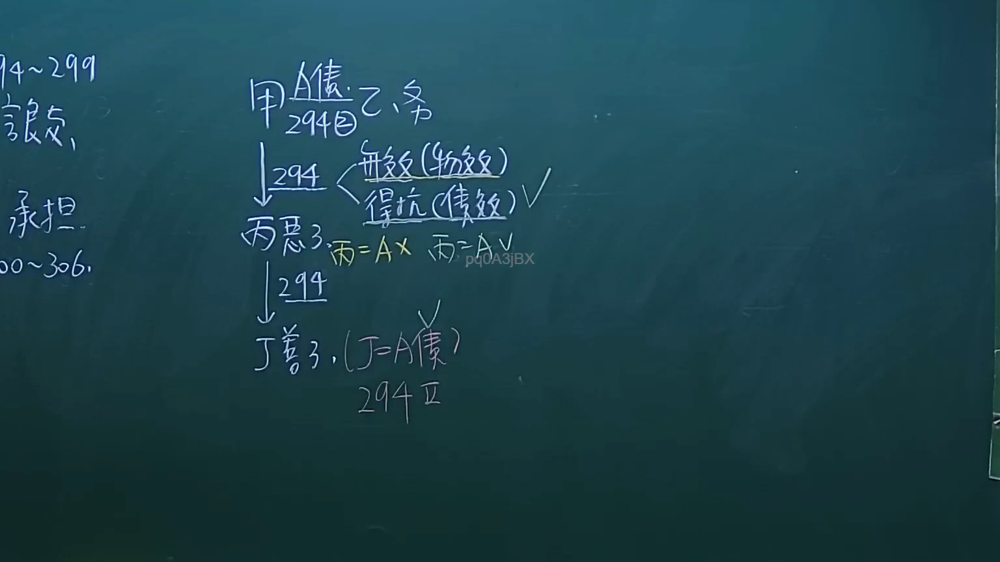
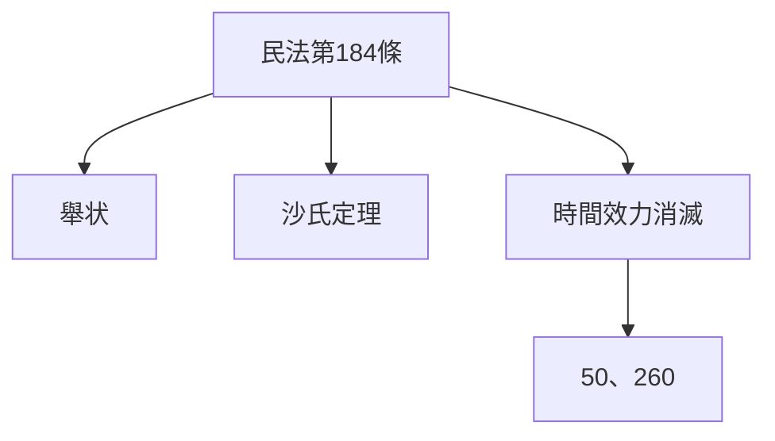
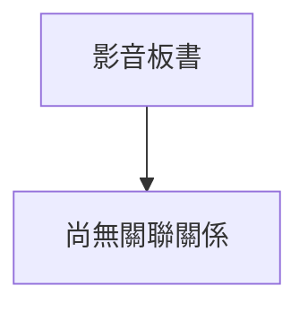

# 🎥 影音教材板書校對筆記
- **來源影片**: [預約 26 2024-09-04 21-37-00-498](file:///J://民法/ch26/預約 26 2024-09-04 21-37-00-498.mp4)
- **課程分類**: `[民法`
- **課堂章節**: `ch26]`
- **影片時間戳記**: `01:17:15` (4635 秒)
- **板書類型**: `文字板書`
- **偵測時間**: 2026-07-12 17:14:14

## 🔍 擷取黑板板書對照圖

## 🧠 AI 智慧理解與知識庫演化註記
1. **"叫雕"**：在民法第184條中提到「举状」，即請求人民法院受理訴訟的手段。叫雕是其中一个可能的表達方式，用於表明訴求之意。

2. **"田奕"**：這可能是特定的Legal terminology或name，在此上下文中可能指特定的Legal case或theorem，需進一步探討其具體含義。

3. **"沙】三二"**：這可能是「沙氏定理」（Shia's theorem）的表述，用於分析time limitation（時間限額）問題。在民法第184條中，time limitation是消滅訴訟權利的重要因素。

4. **"50、260"**：這可能是特定的number引用，用於time limitation的計算或application。需查看其在民法中的具體應用。

**knowledge库比對與理解演化註記**：
- 民法第184條：「举状」是請求人民法院受理訴訟的手段，具有time limitation的效果。
- 沙氏定理：用於分析time limitation問題，並在特定条件下消滅訴訟權利。
- 50、260：可能指特定的number引用，在time limitation的計算或application中起重要作用。

** MERMAID 代碼 **：

此关系图展示了民法第184条作为基础，连接到举状、沙氏定理和时间效力消滅，最后连接到50、260。

## 📊 可編輯之 Mermaid 關係流程圖

## ✍️ 操作者手動校對修改區
<!-- 您可以直接修改上方的文字或調整 Mermaid 區塊中的節點，Obsidian 會即時重新渲染 -->
- [ ] 欄位結構與法律邏輯已校對無誤。
- **校對筆記**: 
