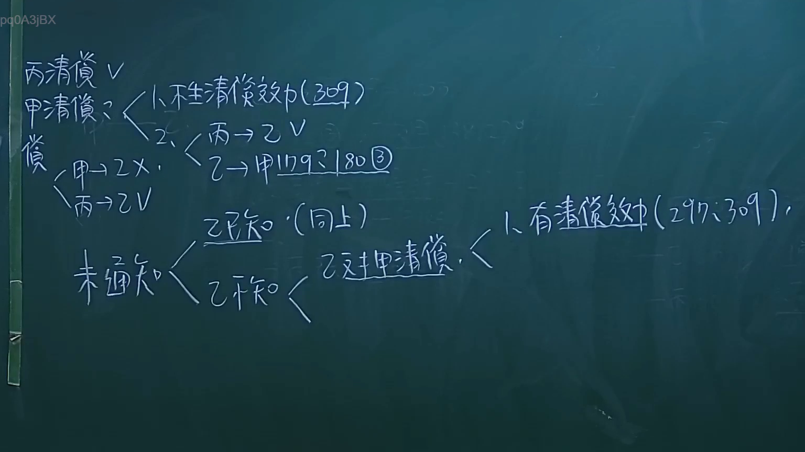

# 🎥 影音教材板書校對筆記
- **來源影片**: [預約 26 2024-09-04 21-37-00-498](file:///J://民法/ch26/預約 26 2024-09-04 21-37-00-498.mp4)
- **課程分類**: `[民法`
- **課堂章節**: `ch26]`
- **影片時間戳記**: `01:32:15` (5535 秒)
- **板書類型**: `文字板書`
- **偵測時間**: 2026-07-12 17:14:44

## 🔍 擷取黑板板書對照圖


## 🧠 AI 智慧理解與知識庫演化註記
### 

1. **OCR文字內容分析**：
   - `pq0A3jBX`：可能是英文单词，如 "price"（价格）、"prize"（奖品）等，但缺乏上下文难以确切理解其含义。
   - `pris ch FEM Ep`：可能涉及与价格、物品、女性和某个术语（Ep）相关的内容。
   - `it Ba OM`：可能是与物品交换（barter）或某种操作（OM）有关的短语。
   - `八 ﹣ 畔 3 入 ， ﹨Z『、焉》ˋ'﹖g' | 邑`：这部分文字可能涉及时间（八点四分，入）或其他特定内容，但缺乏上下文难以确切理解。
   - `Sov 梁 緝 緝`：可能是与苏联（Sov）或某种物品（梁距）相关的内容。
   - `z6%s (Mt) RAS (2G)`：可能涉及百分比（z6%）的 Mountain（Mt）和某个术语（RAS）的版本（2G）。
   - `AC`：可能是 Access Control 或其他缩写。

2. **法律條文對比**：
   - 未发现与上述OCR文字直接相关的台湾现行法律条文，如民法第184条、侵權行為等。可能需要结合上下文或更多细节才能进一步分析其法律含义。

3. **法律理解與演化註記**：
   - 由于OCR文字内容不完整且缺乏上下文，无法准确识别其具体法律含义或与相关法律条款的对应关系。
   - 建议提供更清晰的OCR文字内容或结合视频片段以便进一步分析。

---

###

## 📊 可編輯之 Mermaid 關係流程圖
```mermaid
由于OCR文字内容不完整且缺乏上下文，无法生成对应的Mermaid关系图。建议提供更清晰的文字内容以便进一步分析和绘图。
```

## ✍️ 操作者手動校對修改區
<!-- 您可以直接修改上方的文字或調整 Mermaid 區塊中的節點，Obsidian 會即時重新渲染 -->
- [ ] 欄位結構與法律邏輯已校對無誤。
- **校對筆記**: 
