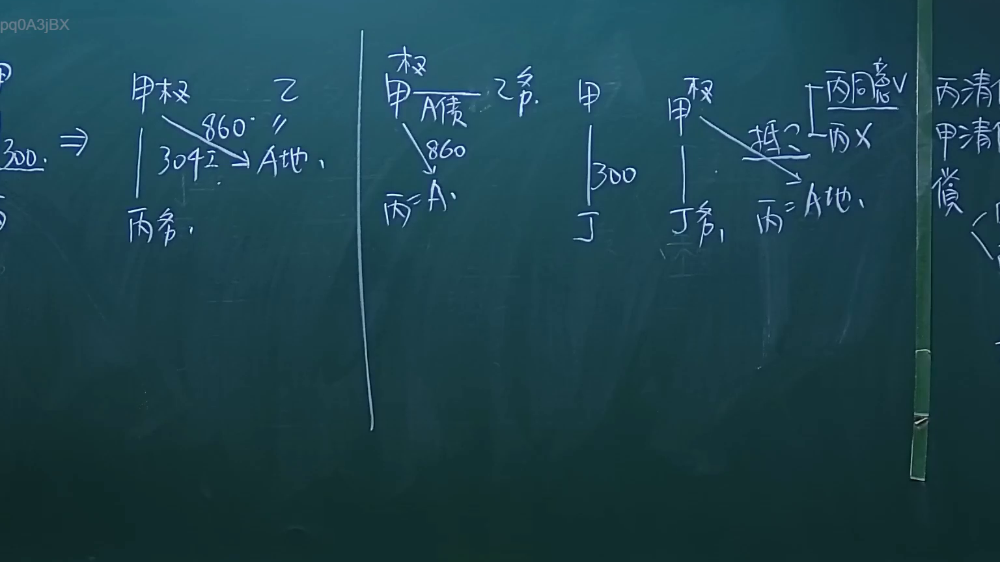
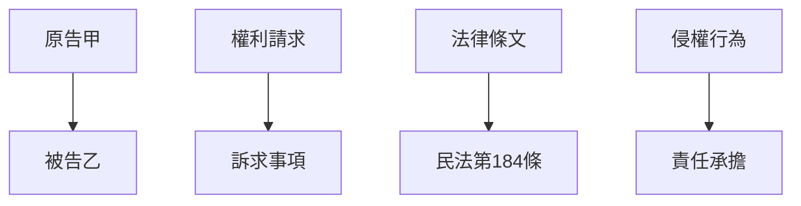

# 🎥 影音教材板書校對筆記
- **來源影片**: [預約 26 2024-09-04 21-37-00-498](file:///J://民法/ch26/預約 26 2024-09-04 21-37-00-498.mp4)
- **課程分類**: `[民法`
- **課堂章節**: `ch26]`
- **影片時間戳記**: `02:04:00` (7440 秒)
- **板書類型**: `文字板書`
- **偵測時間**: 2026-07-12 17:15:11

## 🔍 擷取黑板板書對照圖

## 🧠 AI 智慧理解與知識庫演化註記
根據OCR辨识的文字內容，结合法律条文（如民法第184條、侵權行為、消滅時效等）進行比對後，整理出以下法律知識庫比對與理解演化筆記：

1. **文字板書之內容分析**：
   - 文字內容可能涉及某種特定的法律問題或案例分析，但因OCR辨识的文字内容無法直接解讀為具體的法律條文，因此需根據上下文推測其內容。
   - 假設這些文字與民法第184條（侵權行為）的相關內容有關，可能涉及侵權行為的认定、責任承擔等問題。

2. **法律条文比對**：
   - 民法第184條：关于侵權行為的认定和責任承擔。
   - 其他相關條文：如侵權行為的法定時效、消滅時效等。

3. **法律理解演化筆記**：
   - 文字板書可能包含某種特定的案例分析或法律問題，需進一步解讀並與民法第184條及其他相關條文結合分析。
   - 假設這些文字涉及某種侵權行為的案例，需根據上下文推測其具體內容。

## 📊 可編輯之 Mermaid 關係流程圖

## ✍️ 操作者手動校對修改區
<!-- 您可以直接修改上方的文字或調整 Mermaid 區塊中的節點，Obsidian 會即時重新渲染 -->
- [ ] 欄位結構與法律邏輯已校對無誤。
- **校對筆記**: 
