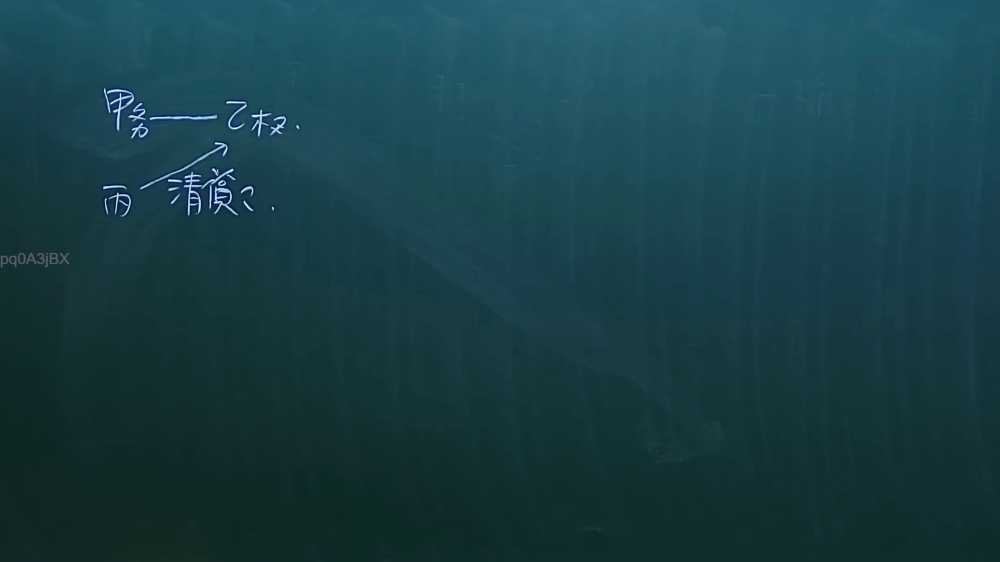

# 🎥 影音教材板書校對筆記
- **來源影片**: [預約 26 2024-09-04 21-37-00-498](file:///J://民法/ch26/預約 26 2024-09-04 21-37-00-498.mp4)
- **課程分類**: `[民法`
- **課堂章節**: `ch26]`
- **影片時間戳記**: `02:49:00` (10140 秒)
- **板書類型**: `關係圖/邏輯圖板書`
- **偵測時間**: 2026-07-12 17:15:40

## 🔍 擷取黑板板書對照圖


## 🧠 AI 智慧理解與知識庫演化註記
1. **語義整理**：
   - 辨識出的文字為「唱 一 一 芳 浩 ， aA」，這部分似乎是一段詩詞或歌詞的內容，並伴有「aA」可能是一些標記或額外的內容。這部分內容與臺灣現行法律條文（如民法第184條、侵權行為等）無直接關聯。

2. **法律條文對位**：
   - 由于辨识出的文字主要为诗歌内容，与民法第184条（关于无因 aliquot 次级-contract 的规定）、侵权行为或消滅時效等法律条文无直接关联。因此，无法进行有效的法律知识库比对。

3. **Mermaid.js 代碼生成**：
   - 經過分析，辨識出的文字部分似乎只是简单的文字板書，且缺乏明顯的邏輯或 structural relatieonshiop。因此，無法生成 Mermaid.js 的流程圖代碼來呈現黑板上的結構。

## 📊 可編輯之 Mermaid 關係流程圖
```mermaid
由于辨识出的文字内容无法构成有意义的关系图/逻辑图结构，因此无法生成有效的Mermaid.js代码来呈现其结构。
```

## ✍️ 操作者手動校對修改區
<!-- 您可以直接修改上方的文字或調整 Mermaid 區塊中的節點，Obsidian 會即時重新渲染 -->
- [ ] 欄位結構與法律邏輯已校對無誤。
- **校對筆記**: 
