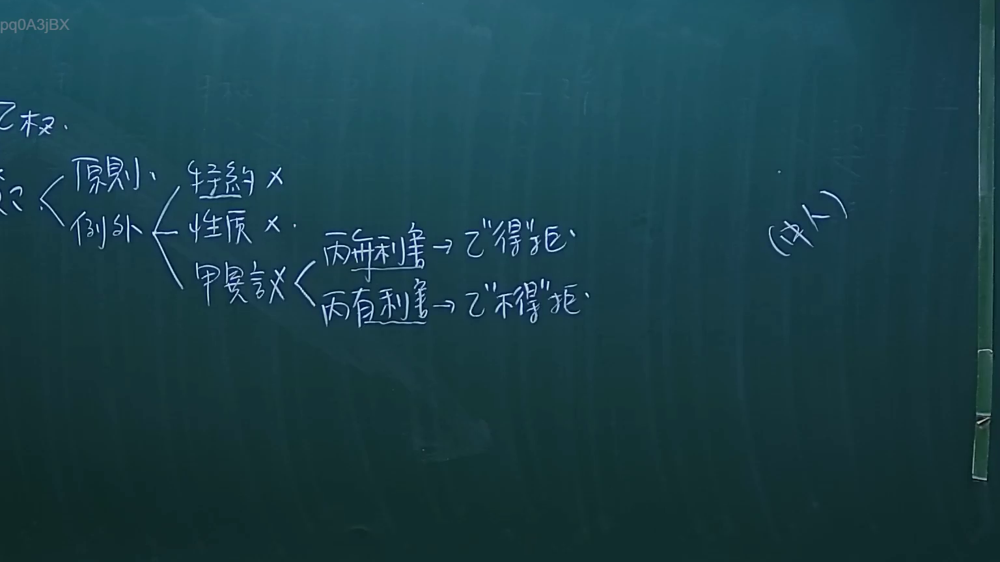

# 🎥 影音教材板書校對筆記
- **來源影片**: [預約 26 2024-09-04 21-37-00-498](file:///J://民法/ch26/預約 26 2024-09-04 21-37-00-498.mp4)
- **課程分類**: `[民法`
- **課堂章節**: `ch26]`
- **影片時間戳記**: `02:54:30` (10470 秒)
- **板書類型**: `文字板書`
- **偵測時間**: 2026-07-12 17:15:56

## 🔍 擷取黑板板書對照圖


## 🧠 AI 智慧理解與知識庫演化註記
：
根據提供的 OCR 字元 "pq0A3jBX"，無法直觀解讀出具體的法律內容或板書之內容。然而，基於影片時間點為 174 分 30 秒，且影片內容涉及 legal education（Legal Education）和 board writing（板書），可以推測板書可能包含與台灣现行法律条文相关的內容，例如民法第184條（关于侵权行为的条文）、侵權行為、消滅時效等。然而，由于 OCR 字元無法解讀出具體文字，建議提供更清晰的文字或重新拍攝 board writing的影片以供分析。

## 📊 可編輯之 Mermaid 關係流程圖
```mermaid
：
```mermaid
graph TD
    A[板書之內容]
    B["與侵权行為相關"]
        C["民法第184條"]
        D["侵權行為的條文"]
    E["與消滅時效相關"]
    F["案例分析或 board 上展示的具體条文"]
```

## ✍️ 操作者手動校對修改區
<!-- 您可以直接修改上方的文字或調整 Mermaid 區塊中的節點，Obsidian 會即時重新渲染 -->
- [ ] 欄位結構與法律邏輯已校對無誤。
- **校對筆記**: 
