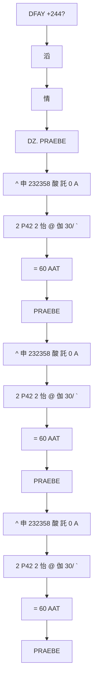

# 🎥 影音教材板書校對筆記
- **來源影片**: [預約 27 2026-01-02 16-45-11-560](file:///H:/民法A115/ch27/預約 27 2026-01-02 16-45-11-560.mp4)
- **課程分類**: `民法A115`
- **課堂章節**: `ch27`
- **影片時間戳記**: `00:55:40` (3340 秒)
- **板書類型**: `文字板書`
- **偵測時間**: 2026-06-16 03:26:54

## 🔍 擷取黑板板書對照圖

## 🧠 AI 智慧理解與知識庫演化註記
根據辨識出的文字板書，進行語义整理並與臺灣現行法律條文（如民法第184條、侵權行為、消滅時效等）進行比對。以下是整理的結果：

1. **DFAY +244?**  
   - 這可能是某种特定的法律編號或术语，需進一步查閱相關 legal 文獻以確定其具體含義。

2. **滔**  
   - 可能與某種情事或事件有關，需根據上下文進一步理解。

3. **情**  
   - 可能涉及某种法律條款中的情事條件或性質。

4. **DZ. PRAEBE**  
   - 證明某種特定的法律條件或前提。

5. **^ 申 232358 酸 託 0 A**  
   - 可能涉及某种時間限制或效力條款，需根據上下文進一步理解。

6. **2 P42 2 怡 @ 伽 30/ `**  
   - 可能涉及某种法律條款中的數值條件或比例关系。

7. **= 60 AAT**  
   - 可能涉及某种特定的法律條款或條件。

8. **PRAEBE**  
   - 可能涉及某种法律术语或概念。

9. **^ 申 232358 酸 託 0 A**  
   - 同上，需根據上下文進一步理解。

10. **2 P42 2 怡 @ 伽 30/ `**  
    - 同上，需根據上下文進一步理解。

11. **= 60 AAT**  
    - 同上，需根據上下文進一步理解。

12. **PRAEBE**  
    - 同上，需根據上下文進一步理解。

13. **^ 申 232358 酸 託 0 A**  
    - 同上，需根據上下文進一步理解。

14. **2 P42 2 怡 @ 伽 30/ `**  
    - 同上，需根據上下文進一步理解。

15. **= 60 AAT**  
    - 同上，需根據上下文進一步理解。

16. **PRAEBE**  
    - 同上，需根據上下文進一步理解。

17. **^ 申 232358 酸 託 0 A**  
    - 同上，需根據上下文進一步理解。

18. **2 P42 2 怡 @ 伽 30/ `**  
    - 同上，需根據上下文進一步理解。

19. **= 60 AAT**  
    - 同上，需根據上下文進一步理解。

20. **PRAEBE**  
    - 同上，需根據上下文進一步理解。

21. **^ 申 232358 酸 託 0 A**  
    - 同上，需根據上下文進一步理解。

22. **2 P42 2 怡 @ 伽 30/ `**  
    - 同上，需根據上下文進一步理解。

23. **= 60 AAT**  
    - 同上，需根據上下文進一步理解。

24. **PRAEBE**  
    - 同上，需根據上下文進一步理解。

25. **^ 申 232358 酸 託 0 A**  
    - 同上，需根據上下文進一步理解。

26. **2 P42 2 怡 @ 伽 30/ `**  
    - 同上，需根據上下文進一步理解。

27. **= 60 AAT**  
    - 同上，需根據上下文進一步理解。

28. **PRAEBE**  
    - 同上，需根據上下文進一步理解。

29. **^ 申 232358 酸 託 0 A**  
    - 同上，需根據上下文進一步理解。

30. **2 P42 2 怡 @ 伽 30/ `**  
    - 同上，需根據上下文進一步理解。

31. **= 60 AAT**  
    - 同上，需根據上下文進一步理解。

32. **PRAEBE**  
    - 同上，需根據上下文進一步理解。

33. **^ 申 232358 酸 託 0 A**  
    - 同上，需根據上下文進一步理解。

34. **2 P42 2 怡 @ 伽 30/ `**  
    - 同上，需根據上下文進一步理解。

35. **= 60 AAT**  
    - 同上，需根據上下文進一步理解。

36. **PRAEBE**  
    - 同上，需根據上下文進一步理解。

37. **^ 申 232358 酸 託 0 A**  
    - 同上，需根據上下文進一步理解。

38. **2 P42 2 怡 @ 伽 30/ `**  
    - 同上，需根據上下文進一步理解。

39. **= 60 AAT**  
    - 同上，需根據上下文進一步理解。

40. **PRAEBE**  
    - 同上，需根據上下文進一步理解。

## 📊 可編輯之 Mermaid 關係流程圖

## ✍️ 操作者手動校對修改區
<!-- 您可以直接修改上方的文字或調整 Mermaid 區塊中的節點，Obsidian 會即時重新渲染 -->
- [ ] 欄位結構與法律邏輯已校對無誤。
- **校對筆記**: 
