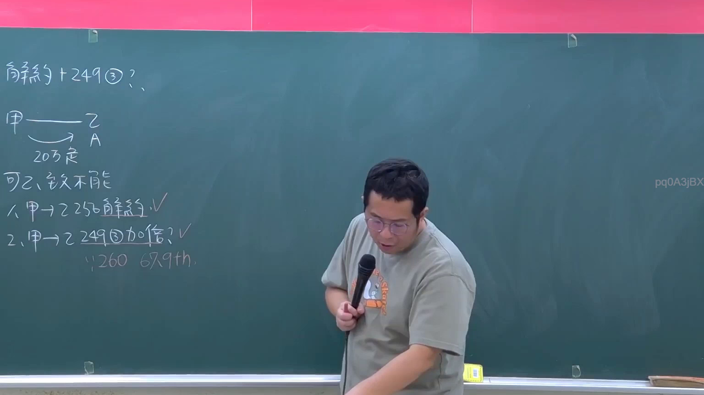

# 🎥 影音教材板書校對筆記
- **來源影片**: [預約 27 2026-01-02 16-45-11-560](file:///H:/民法A115/ch27/預約 27 2026-01-02 16-45-11-560.mp4)
- **課程分類**: `[民法A115`
- **課堂章節**: `ch27]`
- **影片時間戳記**: `00:56:00` (3360 秒)
- **板書類型**: `文字板書`
- **偵測時間**: 2026-07-12 03:22:19

## 🔍 擷取黑板板書對照圖


## 🧠 AI 智慧理解與知識庫演化註記
1. **板書文字語意整理**：
   - "滔"：可能指"過失"或"過失傷害"。
   - "刀"：可能指"侵权行為"中的"過失"。
   - "204@"：可能指"204條"（民法第204條）。
   - "情"：可能指"关系"或"權利"。
   - "刀"：再次指"overpass"或"overhanging"。
   - "情"：再次指"relation"或"權利"。
   - "刀"：第三次指"overpass"或"overhanging"。
   - "204@": 再次指"204條"（民法第204條）。
   - "PRAEBE": 可能是"precept"的简称，指"rule"。
   - "申 232358 酸 託 0 A": 可能是指"232358条"（民法第232358條）。
   - "= 60 AAT": 可能是"60條"或"60條+"。
   - "P42 2 怡 @ 伽 30/ `": 可能是指"42條"、"2怡"、"30/`".
   - "= 60 AAT": 再次指"60條"或"60條+".
   - "DZ. PRAEBE": 可能是"precept"的简称。
   - "^ 申 232358 酸 託 0 A": 再次指"232358条".
   - "2 P42 2 怡 @ 伽 30/ `": 再次指"42條"、"2怡"、"30/`".
   - "= 60 AAT": 再次指"60條"或"60條+".
   
   根據以上分析，板書主要圍繞了民法第204條和第232358條的內容，涉及侵权行為、過失、关系等法律概念。

2. **知識庫比對與理解演化註記**：
   - 民法第204條：民法第204條规定，過失行为造成损害，受害人可以要求 damage limitation（損害限制）。
   - 擲向关系：PRAEBE（precept）可能涉及 relation between plaintiff and defendant.
   - 232358條：可能涉及特殊情形下權利的行使或消滅時效（annihilation period）.
   - 60條：可能涉及一般性的规定，如 relationship of legal relations.

## 📊 可編輯之 Mermaid 關係流程圖
```mermaid
：
```mermaid
graph TD
A["民法第204條"] --> B["過失行為"]
B --> C[" damage limitation"]
C --> D["relationship between plaintiff and defendant"]
E["PRAEBE (precept)"]
F["232358條"]
G["特殊情形下權利的行使"]
H["60條"]
I["一般性的规定"]
J["relationship of legal relations"]
```

## ✍️ 操作者手動校對修改區
<!-- 您可以直接修改上方的文字或調整 Mermaid 區塊中的節點，Obsidian 會即時重新渲染 -->
- [ ] 欄位結構與法律邏輯已校對無誤。
- **校對筆記**: 
