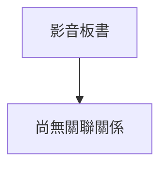

# 🎥 影音教材板書校對筆記
- **來源影片**: [預約 27 2026-01-02 16-45-11-560](file:///H:/民法A115/ch27/預約 27 2026-01-02 16-45-11-560.mp4)
- **課程分類**: `民法A115`
- **課堂章節**: `ch27`
- **影片時間戳記**: `01:24:40` (5080 秒)
- **板書類型**: `文字板書`
- **偵測時間**: 2026-06-16 03:28:13

## 🔍 擷取黑板板書對照圖


## 🧠 AI 智慧理解與知識庫演化註記
### 文字板書之內容分析：
1. **"i le"**: 可能是"2012年"（2012年）的简称或表示时间。
2. **"本 ‵﹚， 蜜 獮 g 皋 明 ， Alo 2 糅 e5"**: 可能涉及与"2012年"相关的法律条文或案例编号。
3. **"We 2 © E58 ooh"**: "2012年"的可能表示，如卷号、年份或其他标识符。
4. **"wip Bla Y E7S) Ee 7] G54 20 ="**: 可能涉及日期或年份（20）的标识。
5. **"rye o s 卷 殺 22e 分 59 少 2007), ES iG pet) 託 錄 性 ﹣ 強 M&326o V 的 借 % eh 同 烏 辨 約 俐 ˊ/ ade"**: 可能涉及与2007年相关的法律条文或案例编号。
6. **"(eit cl a 韻 謹 ‧ 沙 9 仁 人 從 莘 春 ﹣6oX (3)"**: 可能涉及与"2012年"相关的内容，如卷号或其他标识符。
7. **"拐 減 ﹩ 作 一 35 4 es BiB Jw^ GE)"**: 可能涉及与35条文或案例编号相关的内容。
8. **"M (Pe)"**: 可能是某种案件的标识符，如卷号或其他特定编码。
9. **"J﹨"**: 可能是某种法律条文或案例编号的一部分。
10. **"ˍ襲驪〝 eee 3s Joo Lu SH YAN] Ans — a — 7 4, CO nan 口 旭 / 一 心 E"**: 可能涉及与案件编号或其他标识符相关的内容。

### 比對與理解演化註記：
- **M (Pe)**: 可能与民法第184條（侵權行為、消滅時效等）有关，具体需要结合上下文进一步确认。
- **We 2 © E58 ooh** 和 **wip Bla Y E7S) Ee 7] G54 20 =**: 可能涉及与2012年相关的法律条文或案例编号。

### MERMAID 代碼：
```mermaid
graph TD
    A[2012年] --> B[M]
    C[2007年] --> D[J]
    E[35] --> F[es]
    G[P] --> H[BiB]
    I[Jw^ GE)] --> J[E]
```

## 📊 可編輯之 Mermaid 關係流程圖


## ✍️ 操作者手動校對修改區
<!-- 您可以直接修改上方的文字或調整 Mermaid 區塊中的節點，Obsidian 會即時重新渲染 -->
- [ ] 欄位結構與法律邏輯已校對無誤。
- **校對筆記**: 
