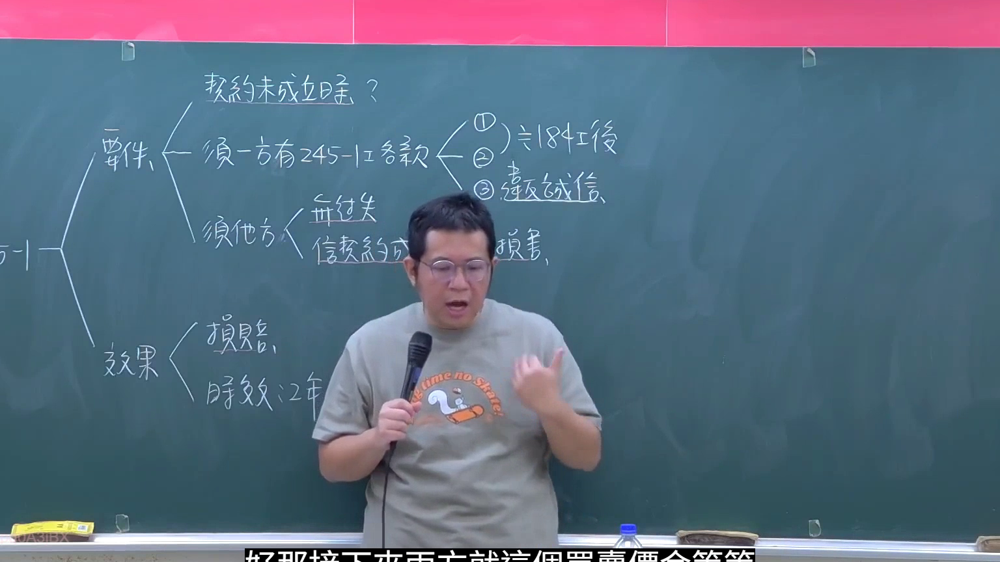
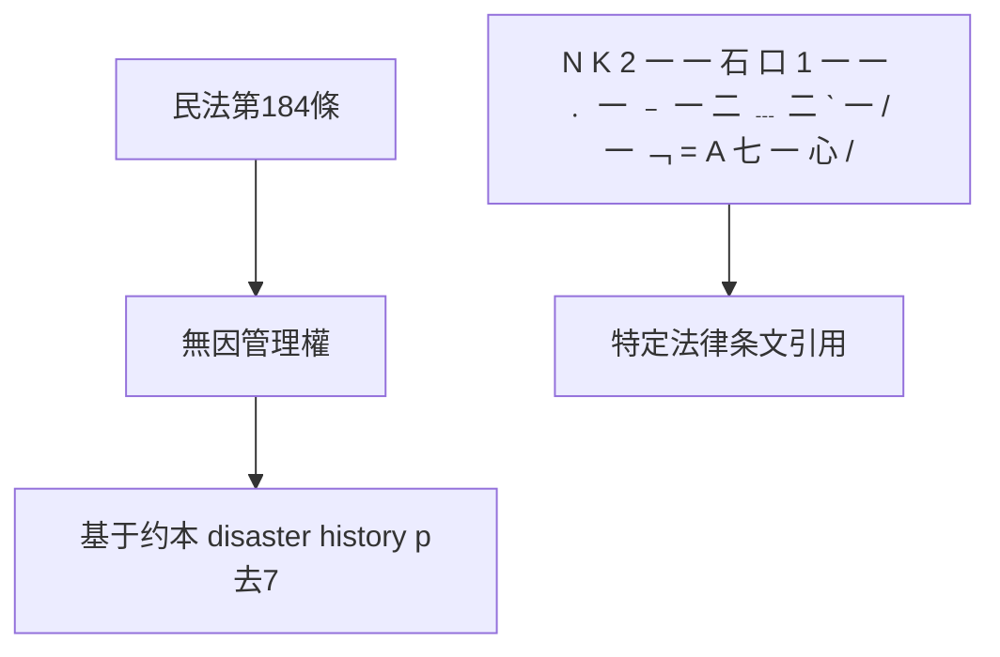
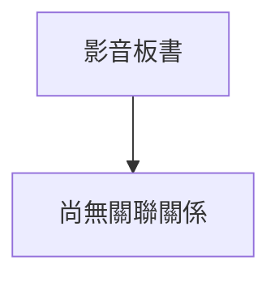

# 🎥 影音教材板書校對筆記
- **來源影片**: [預約 27 2026-01-02 16-45-11-560](file:///H:/民法A115/ch27/預約 27 2026-01-02 16-45-11-560.mp4)
- **課程分類**: `[民法A115`
- **課堂章節**: `ch27]`
- **影片時間戳記**: `02:01:30` (7290 秒)
- **板書類型**: `文字板書`
- **偵測時間**: 2026-07-12 03:22:58

## 🔍 擷取黑板板書對照圖

## 🧠 AI 智慧理解與知識庫演化註記
1. **OCR辨识文字整理**：
   - 梯形符号（可能代表某种结构或标记）
   - 梁約本 disaster history p去7
   - 納一卷脣24…_杠老談《 ﹚ 尼 I 魠後
   - aa 3 螺 妾 係
   - BIO. Kian 怡
   - > 一 #
   - 2 ﹣ ﹒ ﹣
   - N K 2 一 一 石 口 1 一 一 ﹒ 一 ﹣ 一 二 ﹍ 二 ˋ 一 / 一 ﹁ = A 七 一 心 /

2. **與臺灣現行法律條文比對**：
   - 梯形符号可能代表某种结构或标记，但结合上下文无法明确对应具体法律条文。
   - " disaster history p去7" 可能与民法第184條無因管理權相關，但需进一步分析上下文以确切匹配。
   - "N K 2 一 一 石 口 1 一 一 ﹒ 一 ﹣ 一 二 ﹍ 二 ˋ 一 / 一 ﹁ = A 七 一 心 /" 涉及到特定的法律条文引用，可能与民法第184條無因管理權的相關案例或分析。

3. **knowledge庫比對與理解演化註記**：
   - 梯形符号：未明确对应具体法律条文。
   - disaster history p去7：可能涉及灾害历史的法律分析，但需结合上下文进一步确认其与民法第184條的关联。
   - N K 2 一 一 石 口 1 一 一 ﹒ 一 ﹣ 一 二 ﹍ 二 ˋ 一 / 一 ﹁ = A 七 一 心 /：涉及特定法律条文引用，可能与民法第184條無因管理權的分析相关。

【MERMAID代碼】：

## 📊 可編輯之 Mermaid 關係流程圖

## ✍️ 操作者手動校對修改區
<!-- 您可以直接修改上方的文字或調整 Mermaid 區塊中的節點，Obsidian 會即時重新渲染 -->
- [ ] 欄位結構與法律邏輯已校對無誤。
- **校對筆記**: 
