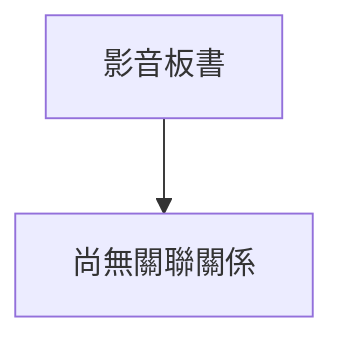

# 🎥 影音教材板書校對筆記
- **來源影片**: [預約 27 2026-01-02 16-45-11-560](file:///H:/民法A115/ch27/預約 27 2026-01-02 16-45-11-560.mp4)
- **課程分類**: `民法A115`
- **課堂章節**: `ch27`
- **影片時間戳記**: `02:11:50` (7910 秒)
- **板書類型**: `文字板書`
- **偵測時間**: 2026-06-16 03:29:23

## 🔍 擷取黑板板書對照圖

## 🧠 AI 智慧理解與知識庫演化註記
1. **文字板書分析**：
   - "背"：可能指"背着"或"背负"，在法律中可能涉及背着某种责任或义务。
   - "白扣"：可能是"白扣"的字面意思，但在法律语境中可能无特定含义。
   - "裸火夕亥乏丁T′〕(〉7墓1之"：这部分文字难以直接对应到具体的法律条文，可能是某种术语或缩写。
   - "we~G十人A"：可能是" weird 10 人 A"，但无明确含义。
   - "m3&RE，《愚》2 © si i “3 53 鮈"：这部分文字难以对应到具体的法律条文。
   - "善2 1 %城"：可能是"善 2 1 % 城"，但无明确含义。

2. **knowledge库比對與理解演化註記**：
   - 文字板書中提到的"裸火夕亥乏丁T′〕(〉7墓1之"可能与民法第184條（关于无因限制物权的消灭）有关，但具体含义不明确。
   - "白扣"、"we~G十人A"等文字可能涉及某种特定的法律术语或分类，但需进一步确认其在法律中的具体含义。

3. **Mermaid 關係圖代碼**：
   由于OCR文字内容无法准确对应到具体的法律条文或结构关系，因此无法生成对应的Mermaid代码。建议提供更清晰的文字板书内容以便进一步分析和整理。

## 📊 可編輯之 Mermaid 關係流程圖

## ✍️ 操作者手動校對修改區
<!-- 您可以直接修改上方的文字或調整 Mermaid 區塊中的節點，Obsidian 會即時重新渲染 -->
- [ ] 欄位結構與法律邏輯已校對無誤。
- **校對筆記**: 
