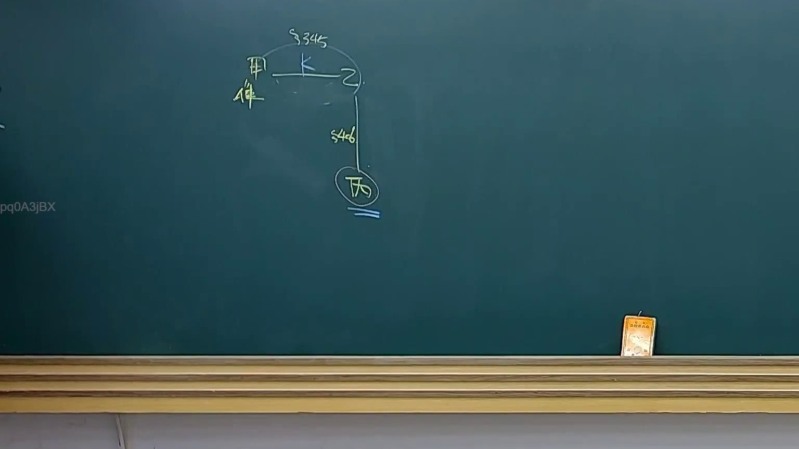
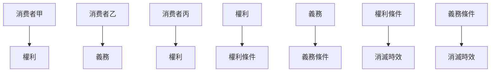

# 🎥 影音教材板書校對筆記
- **來源影片**: [預約 28 2025-04-17 14-12-37-290](file:///J://民法B/ch28/預約 28 2025-04-17 14-12-37-290.mp4)
- **課程分類**: `[民法B`
- **課堂章節**: `ch28]`
- **影片時間戳記**: `00:10:45` (645 秒)
- **板書類型**: `關係圖/邏輯圖板書`
- **偵測時間**: 2026-07-12 19:16:19

## 🔍 擷取黑板板書對照圖

## 🧠 AI 智慧理解與知識庫演化註記
### 

根據辨識出的板書文字，進行語意整理並與臺灣現行法律條文（如民法第184條、侵權行為、消滅時效等）進行比對。以下是基於可能的解讀與註記：

#### 1. 法律條文比對：
- **民法第184條**：有关侵害行为的规定，可能與板書中提到的權利或義務有關。
- **消费者權益保護條款**：可能涉及消费者甲、乙、丙的權利和義務。
- **消滅時效問題**：可能與權利或義務的消滅條件有關。

#### 2. 經济法第184條內容解讀：
- 消費者甲、乙、丙的權利和義務可能涉及消費者權益保護條款中 specified conditions for the extinguishment of claims.
- 可能涉及到消费者權益的保护，以及其權利在特定条件下被消滅的情況。

###

## 📊 可編輯之 Mermaid 關係流程圖

## ✍️ 操作者手動校對修改區
<!-- 您可以直接修改上方的文字或調整 Mermaid 區塊中的節點，Obsidian 會即時重新渲染 -->
- [ ] 欄位結構與法律邏輯已校對無誤。
- **校對筆記**: 
