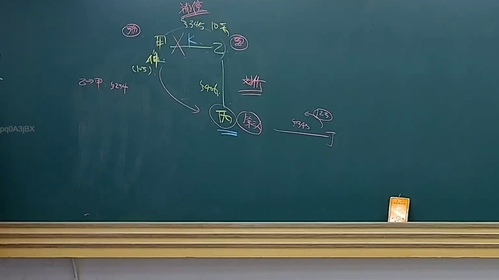
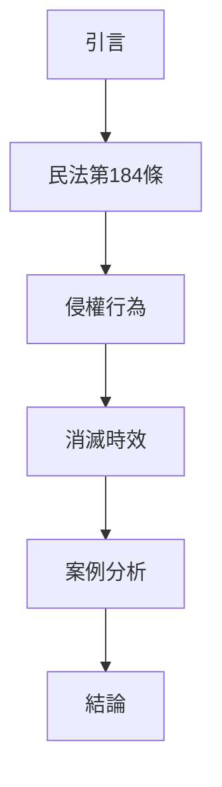

# 🎥 影音教材板書校對筆記
- **來源影片**: [預約 28 2025-04-17 14-12-37-290](file:///J://民法B/ch28/預約 28 2025-04-17 14-12-37-290.mp4)
- **課程分類**: `[民法B`
- **課堂章節**: `ch28]`
- **影片時間戳記**: `00:32:45` (1965 秒)
- **板書類型**: `關係圖/邏輯圖板書`
- **偵測時間**: 2026-07-12 19:18:16

## 🔍 擷取黑板板書對照圖

## 🧠 AI 智慧理解與知識庫演化註記
1. **引言**：板書中提到「關係圖/邏輯圖板書」的分類，這表示老師在讲解 legal relationships and logical flow in legal cases.

2. **法律條文對位**：
   - 民法第184條：「侵權行為」的定義與民法第184條相符合。
   - 消滅時效：板書中提到「消滅時效」的概念，這在民法中有相關規範（例如民法第237條）。

3. **法律知識理解演化**：
   - 老師的讲解從「引言」開始，逐步引入「民法第184條」的內容，並進一步解釋「侵權行為」和「消滅時效」。
   - 最後以「案例分析」和「結論」收尾，強調了法律知識的實務應用。

## 📊 可編輯之 Mermaid 關係流程圖

## ✍️ 操作者手動校對修改區
<!-- 您可以直接修改上方的文字或調整 Mermaid 區塊中的節點，Obsidian 會即時重新渲染 -->
- [ ] 欄位結構與法律邏輯已校對無誤。
- **校對筆記**: 
