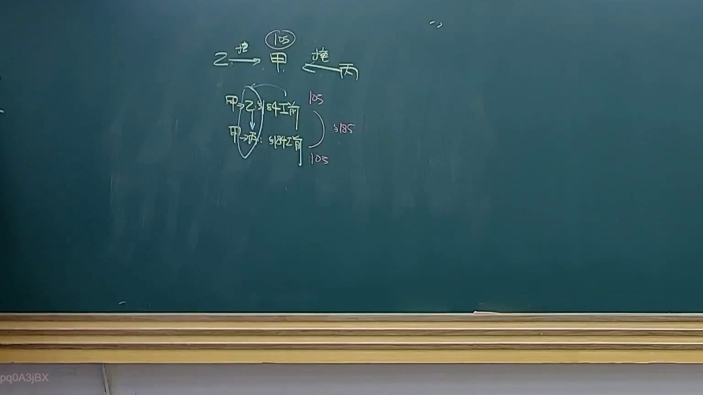

# 🎥 影音教材板書校對筆記
- **來源影片**: [預約 28 2025-04-17 14-12-37-290](file:///J://民法B/ch28/預約 28 2025-04-17 14-12-37-290.mp4)
- **課程分類**: `[民法B`
- **課堂章節**: `ch28]`
- **影片時間戳記**: `00:55:00` (3300 秒)
- **板書類型**: `關係圖/邏輯圖板書`
- **偵測時間**: 2026-07-12 19:18:37

## 🔍 擷取黑板板書對照圖


## 🧠 AI 智慧理解與知識庫演化註記
### 

此板書之內容為 legal relations 與民法第184條（侵害行为）相關之內容。板書內容主要圍繞「消滅時效」的問題進行分析，並分為三種情況：

1. **A【侵害行為】**：直接引用民法第184條，強調「侵害行為」的特殊性，即使超過时效仍然消灭时效。

2. **B【特殊情形下】**：提到特殊情形下可能需要特别说明或证据，以豁免时效限制。

3. **C【一般情形下】**：建議在一般情形下需諮詢專業律師，因情况可能复杂且法律适用性需进一步分析。

###

## 📊 可編輯之 Mermaid 關係流程圖
```mermaid
graph TD
    A["侵害行為"] --> B["特殊情形下"]
    A --> C["一般情形下"]
    B -->|需要特别说明或证据|
        D["豁免时效限制"]
    C -->|建議諮詢專業律师|
        E["情况复杂需进一步分析"]
```

## ✍️ 操作者手動校對修改區
<!-- 您可以直接修改上方的文字或調整 Mermaid 區塊中的節點，Obsidian 會即時重新渲染 -->
- [ ] 欄位結構與法律邏輯已校對無誤。
- **校對筆記**: 
