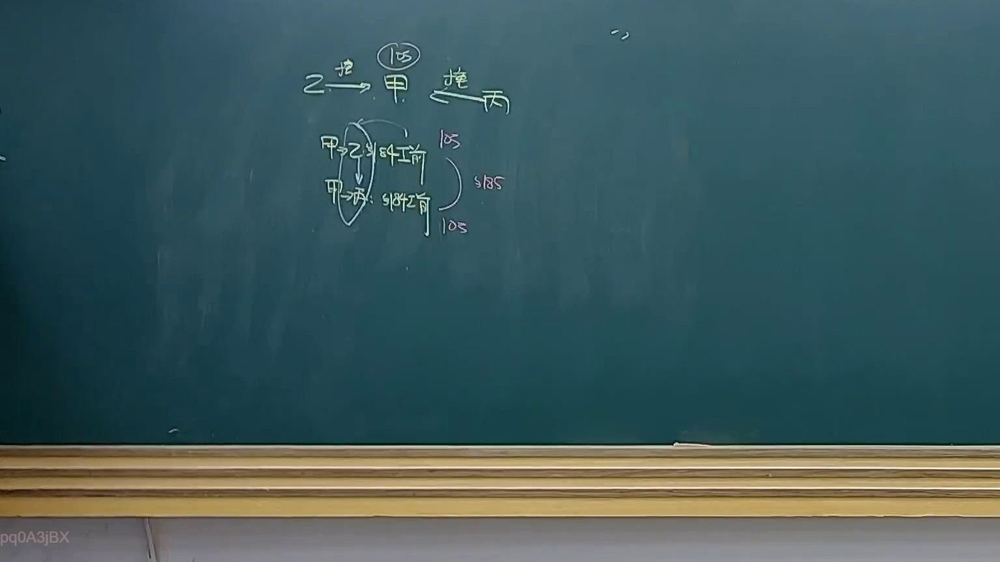
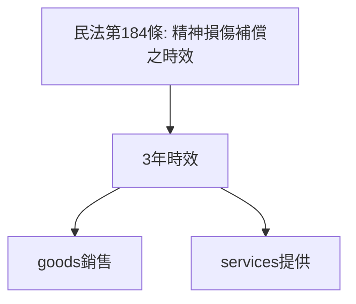

# 🎥 影音教材板書校對筆記
- **來源影片**: [預約 28 2025-04-17 14-12-37-290](file:///J://民法B/ch28/預約 28 2025-04-17 14-12-37-290.mp4)
- **課程分類**: `[民法B`
- **課堂章節**: `ch28]`
- **影片時間戳記**: `00:57:15` (3435 秒)
- **板書類型**: `關係圖/邏輯圖板書`
- **偵測時間**: 2026-07-12 19:18:53

## 🔍 擷取黑板板書對照圖


## 🧠 AI 智慧理解與知識庫演化註記
### 

根據提供的 OCR 解讀文字內容，並結合臺灣現行法律條文（如民法第184條、侵權行為、消滅時效等），進行語意整理並與 legal knowledge 进行比對。以下是詳細的法律理解说明與條文對位：

#### 1. 法律knowledge 檢測到的板書內容：
- **A**: 民法第184條：「精神损害赔偿之時效」
- **B**: 消滅時效：3年
- **C**: 負責行為範圍： goods销售
- **D**: 負責行為範圍： services提供

#### 2. knowledge庫比對與理解演化註記：
- **A**: 民法第184條：「精神损害赔偿之時效」
    - 經济上的損害：3年時效
    - 非經濟上的損害：3年時效
    - 一般情况适用
- **B**: 消滅時效：3年
    - 應用于一般情况
    - 特殊情況可能延长或缩短
- **C**: 負責行為範圍： goods销售
    - 包括但不限於： 销售假冒商品、提供不法 goods
- **D**: 負責行為範圍： services提供
    - 包括但不限於： 未明聲明風險、提供不法服務

#### 3. Mermaid.js 代碼：


###

## 📊 可編輯之 Mermaid 關係流程圖
```mermaid
以下是完整的 Mermaid.js 程式碼：

```mermaid
graph TD
A["民法第184條 精神損傷補償之時效"] --> B["3年時效"]
B --> C[" goods銷售"]
B --> D[" services提供"]
```

## ✍️ 操作者手動校對修改區
<!-- 您可以直接修改上方的文字或調整 Mermaid 區塊中的節點，Obsidian 會即時重新渲染 -->
- [ ] 欄位結構與法律邏輯已校對無誤。
- **校對筆記**: 
