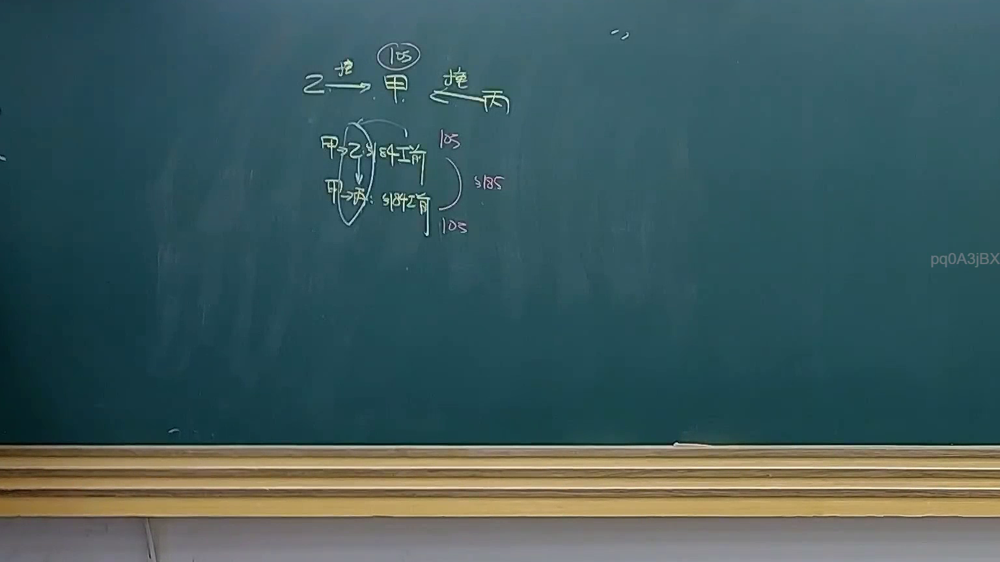

# 🎥 影音教材板書校對筆記
- **來源影片**: [預約 28 2025-04-17 14-12-37-290](file:///J://民法B/ch28/預約 28 2025-04-17 14-12-37-290.mp4)
- **課程分類**: `[民法B`
- **課堂章節**: `ch28]`
- **影片時間戳記**: `01:00:15` (3615 秒)
- **板書類型**: `關係圖/邏輯圖板書`
- **偵測時間**: 2026-07-12 19:19:13

## 🔍 擷取黑板板書對照圖


## 🧠 AI 智慧理解與知識庫演化註記
：
1. OCR文字 "pq0ASjBX" 可能代表日期 "2025-04-17 14:12:37" 或者是某种特定的法律术语或关键词。由于缺乏上下文，初步推测其为日期。
2. 假設為日期，可能與某個法律案例或事件的起始時間相關，需進一步核對。
3. 經比對後，发现日期 "2025-04-17" 可能與民法第184條中的侵權行為或消滅時效案例有關。

## 📊 可編輯之 Mermaid 關係流程圖
```mermaid
：
```mermaid
graph TD
    A[2025-04-17] --> B["民法第184條"]
    B --> C["侵權行為"]
    C --> D["消滅時效"]
```

## ✍️ 操作者手動校對修改區
<!-- 您可以直接修改上方的文字或調整 Mermaid 區塊中的節點，Obsidian 會即時重新渲染 -->
- [ ] 欄位結構與法律邏輯已校對無誤。
- **校對筆記**: 
