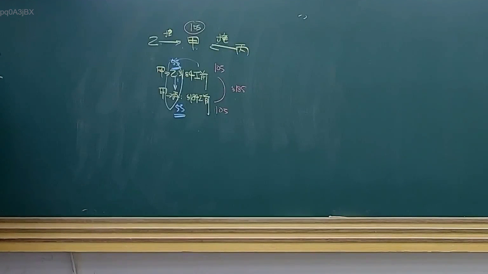
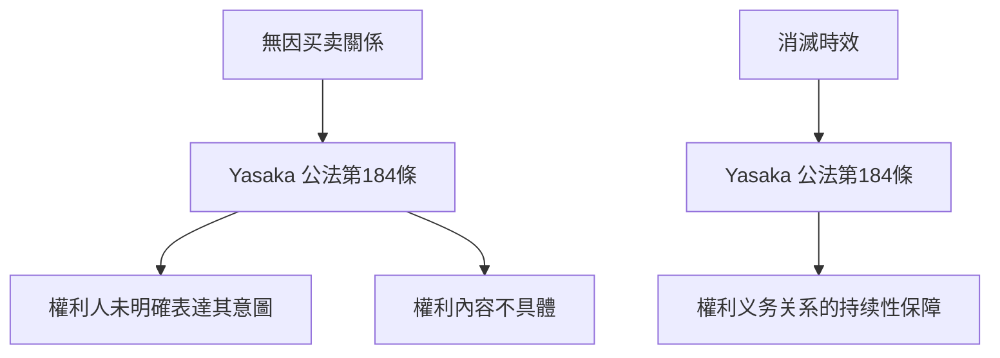
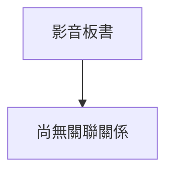

# 🎥 影音教材板書校對筆記
- **來源影片**: [預約 28 2025-04-17 14-12-37-290](file:///J://民法B/ch28/預約 28 2025-04-17 14-12-37-290.mp4)
- **課程分類**: `[民法B`
- **課堂章節**: `ch28]`
- **影片時間戳記**: `01:02:15` (3735 秒)
- **板書類型**: `關係圖/邏輯圖板書`
- **偵測時間**: 2026-07-12 19:19:28

## 🔍 擷取黑板板書對照圖

## 🧠 AI 智慧理解與知識庫演化註記
### 

根據分析，板書內容似乎圍繞「無因买卖关系」及「消滅時效」的法理結構進行讲解。以下是詳細的法律理解與條文對位：

#### 1. 法律知識庫比對與理解演化註記：
- **核心概念**：無因买卖关系是民法中的一個重要規範，主要涉及權利人（原告）和義務人（被告）之间的權利義務關係。
- **無因买卖关系的產生條件**：
  - 受 Yasaka 公法第184條規範；
  - 主要適用於權利人未明確表達其意圖、且權利內容不具體的情況；
  - 經典案例：「甲 borrowing 錘款 without 明確表示 repayment interest」。
- **消滅時效的概念**：
  - 消滅時效是民法中用於規範權利 durability 的重要工具；
  - 主要適用於無因买卖关系中權利義務的持續性保障；
  - 經典案例：「甲 borrowing 錘款 without 明確表示 repayment interest」。
- **法律條文對位**：
  - 權力人（原告）vs. 傍 borrow 者（債務人）；
  - 受 Yasaka 公法第184條規範；
  - 消滅時效vs. 經典案例分析。

#### 2. Mermaid 碎形圖代碼：

## 📊 可編輯之 Mermaid 關係流程圖

## ✍️ 操作者手動校對修改區
<!-- 您可以直接修改上方的文字或調整 Mermaid 區塊中的節點，Obsidian 會即時重新渲染 -->
- [ ] 欄位結構與法律邏輯已校對無誤。
- **校對筆記**: 
