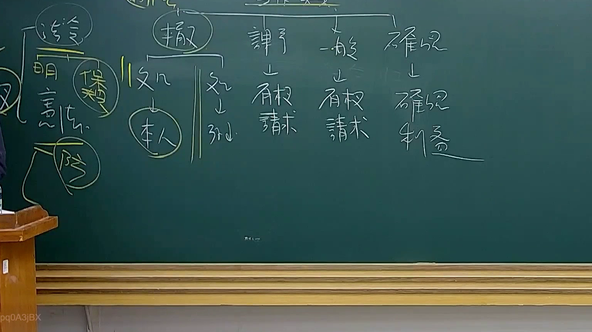
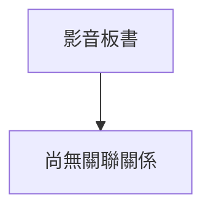

# 🎥 影音教材板書校對筆記
- **來源影片**: [預約 28 2025-08-04 22-06-50-685](file:///J://行政法A/ch28/預約 28 2025-08-04 22-06-50-685.mp4)
- **課程分類**: `[行政法A`
- **課堂章節**: `ch28]`
- **影片時間戳記**: `00:36:00` (2160 秒)
- **板書類型**: `關係圖/邏輯圖板書`
- **偵測時間**: 2026-07-13 12:37:01

## 🔍 擷取黑板板書對照圖

## 🧠 AI 智慧理解與知識庫演化註記
您好！感謝您的詳細說明，但我注意到您提供的訊息中，**OCR 辨識字元部分為空白**——在「擷取區域的 OCR 辨識字元如下：」之後沒有實際的文字內容。

為了完成以下兩項任務：

1. **語意整理與條文比對註記**（如民法第184條、侵權行為、消滅時效等）
2. **Mermaid.js 流程圖代碼生成**

我需要您補充提供該時間點（36分0秒）截圖中辨識出的具體文字內容。

---

請將 OCR 辨識結果貼上，我立刻為您完成分析與圖表生成！

## 📊 可編輯之 Mermaid 關係流程圖

## ✍️ 操作者手動校對修改區
<!-- 您可以直接修改上方的文字或調整 Mermaid 區塊中的節點，Obsidian 會即時重新渲染 -->
- [ ] 欄位結構與法律邏輯已校對無誤。
- **校對筆記**: 
