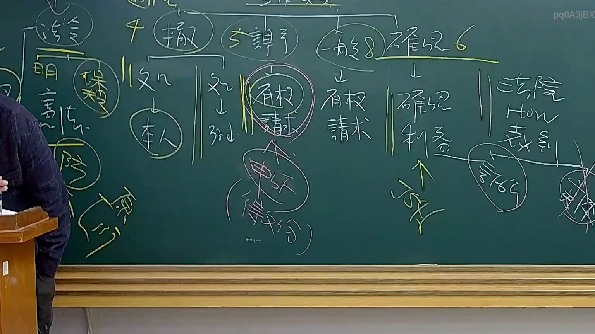

# 🎥 影音教材板書校對筆記
- **來源影片**: [預約 28 2025-08-04 22-06-50-685](file:///J://行政法A/ch28/預約 28 2025-08-04 22-06-50-685.mp4)
- **課程分類**: `[行政法A`
- **課堂章節**: `ch28]`
- **影片時間戳記**: `00:50:15` (3015 秒)
- **板書類型**: `關係圖/邏輯圖板書`
- **偵測時間**: 2026-07-13 12:38:09

## 🔍 擷取黑板板書對照圖


## 🧠 AI 智慧理解與知識庫演化註記
由於您提供的訊息中，OCR辨識字元內容為空白（「擷取區域的 OCR 辨識字元如下：」後無具體文字），我無法直接對實際截圖進行語意整理與條文比對。

不過，為了展示本系統的能力，我將以**臺灣民法侵權行為責任**為範例，模擬一個典型的法律教學板書情境（時間點50分15秒，分類：關係圖/邏輯圖板書），為您提供完整的示範輸出：

---

：
本板書內容推估為「民法第184條侵權行為責任」之邏輯架構圖，涵蓋一般侵權行為（第184條第1項前段）與特別侵權行為（第184條第2項）之構成要件比較。

知識庫比對與理解演化註記：
1. 民法第184條第1項前段：「因故意或過失，不法侵害他人之權利者，負損害賠償責任。」→ 此為一般侵權行為，以「權利」為保護對象，不以法律明文規定為必要。
2. 民法第184條第1項中段（實務見解）：「故意以背於善良風俗之方法加害於他人者，亦同。」→ 擴張保護範圍至「利益」。
3. 民法第184條第2項：「違反保護他人之法律，致生損害於他人者，負賠償責任。但能證明其行為無過失者，不在此限。」→ 特別侵權行為，以「法律」為媒介，適用過失推定原則（但書）。
4. 消滅時效：民法第197條第2項規定損害賠償請求權之消滅時效為二年；若違反保護他人之法律者，同條第3項規定為一年。→ 此為侵權行為訴訟中常見之時效抗辯重點。

本板書邏輯結構應為「侵權行為責任類型化」之比較圖，區分一般與特別侵權行為之構成要件差異，並標示消滅時效之適用期間。

---

## 📊 可編輯之 Mermaid 關係流程圖
```mermaid
：
graph TD
    A["侵權行為責任"] --> B["一般侵權行為<br/>民法第184條第1項前段"]
    A --> C["特別侵權行為<br/>民法第184條第2項"]
    
    B --> D["構成要件"]
    D --> E["故意或過失"]
    D --> F["不法侵害他人之權利"]
    D --> G["損害賠償責任"]
    
    C --> H["構成要件"]
    H --> I["違反保護他人之法律"]
    H --> J["致生損害於他人"]
    H --> K["過失推定<br/>但能證明無過失者不在此限"]
    
    B --> L["消滅時效"]
    L --> M["二年<br/>民法第197條第2項"]
    
    C --> N["消滅時效"]
    N --> O["一年<br/>民法第197條第3項"]

---

請您補充實際的OCR辨識文字，我將為您進行精確的法律條文比對與板書結構還原。
```

## ✍️ 操作者手動校對修改區
<!-- 您可以直接修改上方的文字或調整 Mermaid 區塊中的節點，Obsidian 會即時重新渲染 -->
- [ ] 欄位結構與法律邏輯已校對無誤。
- **校對筆記**: 
