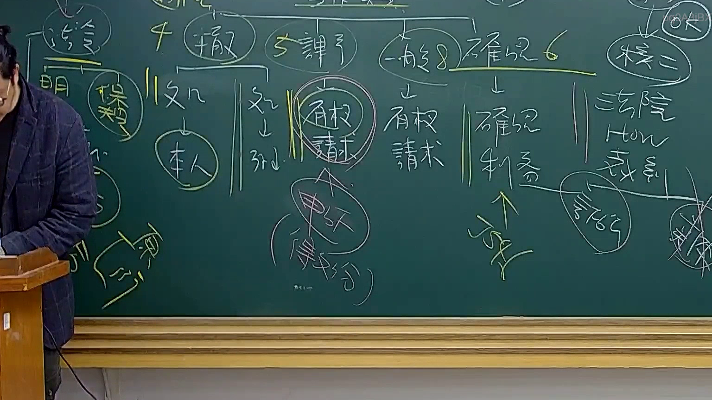

# 🎥 影音教材板書校對筆記
- **來源影片**: [預約 28 2025-08-04 22-06-50-685](file:///J://行政法A/ch28/預約 28 2025-08-04 22-06-50-685.mp4)
- **課程分類**: `[行政法A`
- **課堂章節**: `ch28]`
- **影片時間戳記**: `01:49:00` (6540 秒)
- **板書類型**: `關係圖/邏輯圖板書`
- **偵測時間**: 2026-07-13 12:39:04

## 🔍 擷取黑板板書對照圖


## 🧠 AI 智慧理解與知識庫演化註記
：

您好，感謝您的提問。不過我注意到您提供的訊息中，OCR 辨識字元部分為空白——您在「擷取區域的 OCR 辨識字元如下：」之後並未附上實際的文字內容。

因此我無法進行以下工作：
1. 語意整理與條文比對（如民法第184條侵權行為、消滅時效等）
2. 生成對應的 Mermaid.js 流程圖代碼

請您補充提供該時間點（109分0秒）截圖中的實際 OCR 辨識文字，我將立即為您完成：

- ：條文對位、法律概念釐清、知識演化說明
-

## 📊 可編輯之 Mermaid 關係流程圖
```mermaid
：關係圖/邏輯圖的完整 Mermaid 程式碼（節點用雙引號括住）

期待您的回覆！
```

## ✍️ 操作者手動校對修改區
<!-- 您可以直接修改上方的文字或調整 Mermaid 區塊中的節點，Obsidian 會即時重新渲染 -->
- [ ] 欄位結構與法律邏輯已校對無誤。
- **校對筆記**: 
