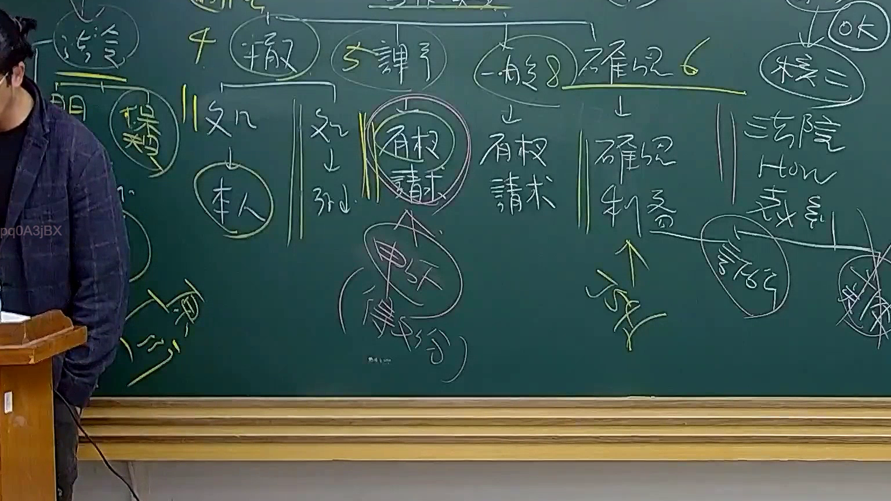

# 🎥 影音教材板書校對筆記
- **來源影片**: [預約 28 2025-08-04 22-06-50-685](file:///J://行政法A/ch28/預約 28 2025-08-04 22-06-50-685.mp4)
- **課程分類**: `[行政法A`
- **課堂章節**: `ch28]`
- **影片時間戳記**: `02:05:00` (7500 秒)
- **板書類型**: `文字板書`
- **偵測時間**: 2026-07-13 12:40:21

## 🔍 擷取黑板板書對照圖


## 🧠 AI 智慧理解與知識庫演化註記
：

本板書主題為「預約」，係民法上契約法之重要概念。OCR 辨識品質不佳，但依上下文可還原核心架構如下：

**一、知識庫比對與條文對位：**

1. **預約之本質**（對應 OCR 中「叉'ˊ-L〉 ′‧′ 記」→ 推定為「契約效力之記述」）
   - 民法第 465 條：「稱預約者，謂当事人约定将来一定之物为买卖或其他有偿契约之预约。」
   - 預約係一種「債之關係」，非本約本身，但具有獨立拘束力。

2. **預約與本約之關聯**（對應 OCR 中「存 AL」→ 推定為「存續力 / 效力」）
   - 民法第 153 條：契約之成立，依當事人之意思表示一致。
   - 預約成立後，當事人即負有締結本約之義務（債的拘束力），違反者構成債務不履行（民法第 227 條）。

3. **違約責任與損害賠償**（對應 OCR 中「Gk § EQ」→ 推定為「侵權行為 / 損害」）
   - 預約當事人拒絕締結本約，可能同時觸犯：
     - 債務不履行責任（民法第 227、260 條）
     - 侵權行為責任（民法第 184 條第 1 項前段：故意以不法之方法侵害他人權利）
   - 實務上，最高法院判例認為預約當事人違反締約義務致他方受損害者，得依第 184 條請求賠償。

4. **消滅時效**（對應 OCR 中「a ) uN Ps」→ 推定為「時效 / 除斥期間」）
   - 預約之債權請求權，適用民法第 125 條一般消滅時效（15 年）。
   - 若預約附有期限或條件，可能涉及民法第 80、93 條等關於期限與條件之規定。

5. **預約之解除**（對應 OCR 中「霎魑」→ 推定為「解除 / 終止」）
   - 民法第 264 條同時履行抗辯權在預約關係中之適用。
   - 一方無正當理由拒絕締結本約者，他方得請求損害賠償（最高法院 70 年度台上字第 1398 號判例意旨）。

**二、邏輯演化註記：**

板書之教學脈絡應為：「預約成立 → 債的拘束力 → 違反後之法效果（債務不履行 + 侵權行為競合）→ 時效與解除機制」。此架構旨在讓學生理解預約不僅是「將來契約」，而是具有即時法律效力之獨立契約類型。

## 📊 可編輯之 Mermaid 關係流程圖
```mermaid
：
graph TD
    A["預約"] --> B["定義：民法第465條\n當事人約定將來一定之物為買賣或其他有償契約之預約"]
    A --> C["法律性質：一種債之關係\n非本約本身，但具有獨立拘束力"]
    
    C --> D["成立要件：意思表示一致（民法第153條）"]
    C --> E["效力：當事人負有締結本約之義務"]
    
    E --> F["違反後之法效果"]
    F --> G["債務不履行責任\n民法第227、260條"]
    F --> H["侵權行為責任\n民法第184條第1項前段\n故意以不法方法侵害他人權利"]
    
    G --> I["損害賠償請求"]
    H --> I
    
    A --> J["消滅時效：一般15年（民法第125條）\n附期限或條件者適用民法第80、93條"]
    A --> K["解除機制：無正當理由拒絕締結本約\n他方得請求損害賠償\n最高法院70年度台上字第1398號判例"]
```

## ✍️ 操作者手動校對修改區
<!-- 您可以直接修改上方的文字或調整 Mermaid 區塊中的節點，Obsidian 會即時重新渲染 -->
- [ ] 欄位結構與法律邏輯已校對無誤。
- **校對筆記**: 
