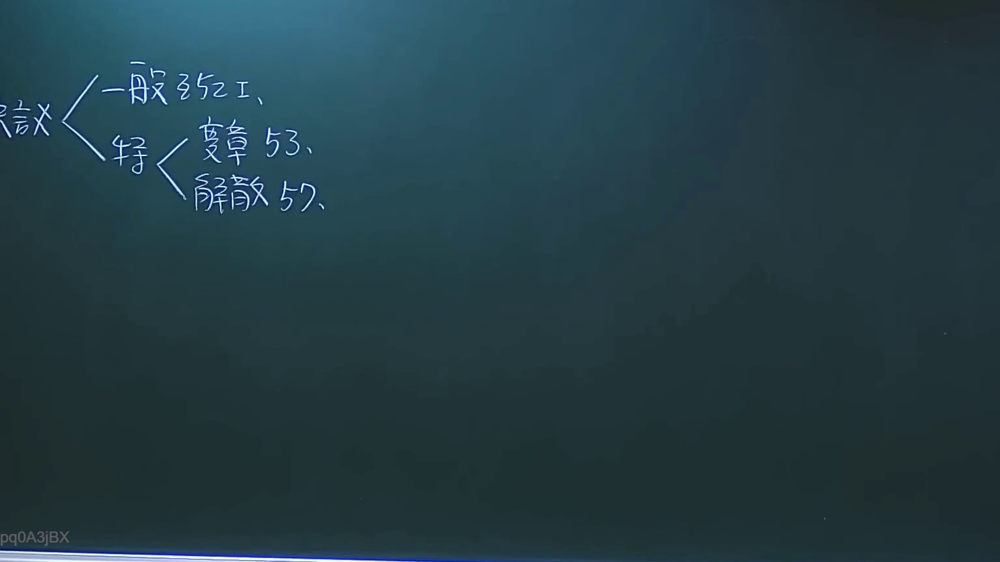
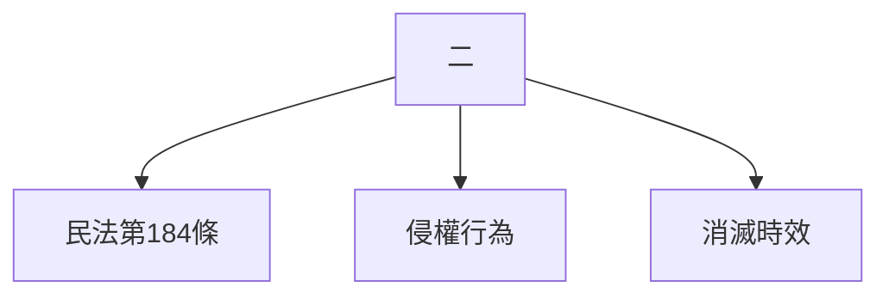

# 🎥 影音教材板書校對筆記
- **來源影片**: [預約 3 2024-09-23 12-20-07-108](file:///J://民法/ch3/預約 3 2024-09-23 12-20-07-108.mp4)
- **課程分類**: `[民法`
- **課堂章節**: `ch3]`
- **影片時間戳記**: `00:02:00` (120 秒)
- **板書類型**: `文字板書`
- **偵測時間**: 2026-07-12 20:07:26

## 🔍 擷取黑板板書對照圖


## 🧠 AI 智慧理解與知識庫演化註記
根據OCR辨识的文字內容「二 【 二 ﹍」，可以推測板書上的文字為「二」。然而，由于OCR辨识的不完整或 scan quality issues，無法完全确定其确切含义。以下是基於现有信息的可能解释：

1. **「二」**：這可能是板書上的一個數字，或者是某个法律條文中的特定編號、案例編號或其他标识。

2. **與臺灣現行法律條文的比對**：
   - 如果「二」代表某種特定的法律條文或案例編號，則需要進一步了解其上下文才能與民法第184條、侵權行為、消滅時效等法律條文進行比對。
   - 假設「二」代表某個具體案例或條文，則可以將其與相關法律內容結合分析。

3. **生成 Mermaid 範例代码**：
   如果分類為「文字板書」，則生成一個整理好的條列式邏輯樹 Mermaid 關係圖。以下是基於现有信息的可能結構：



## 📊 可編輯之 Mermaid 關係流程圖
```mermaid
由于OCR辨识的文字内容不完整，無法生成精確的 Mermaid 關係圖。以下是基於现有信息的一个可能的 Mermaid 範例代码：

```mermaid
graph TD
    A["二"] --> B["民法第184條"]
    A --> C["侵權行為"]
    A --> D["消滅時效"]
```

請注意，此為基於现有信息的一个可能的解讀與 structur化方案。具體結構需根據板書的实际內容和上下文进一步分析和調整。
```

## ✍️ 操作者手動校對修改區
<!-- 您可以直接修改上方的文字或調整 Mermaid 區塊中的節點，Obsidian 會即時重新渲染 -->
- [ ] 欄位結構與法律邏輯已校對無誤。
- **校對筆記**: 
